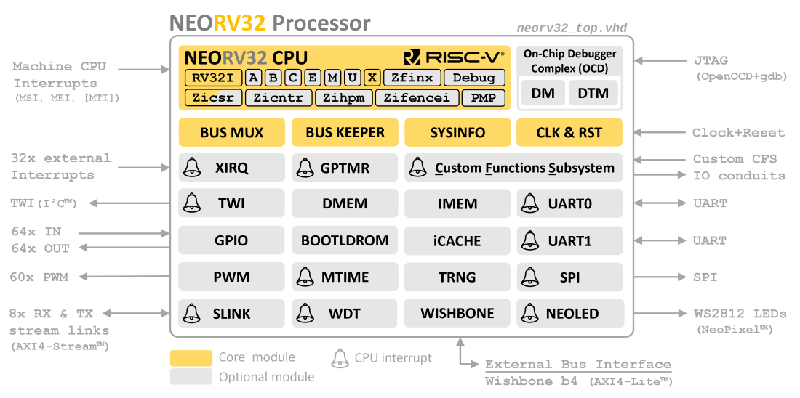

# The NEORV32 RISC-V Processor

The NEORV32 Processor is a **customizable microcontroller-like system on chip (SoC)** built around the NEORV32
[RISC-V](https://riscv.org/) CPU that is written in **platform-independent VHDL**. The processor is intended as auxiliary
controller in larger SoC designs or as tiny and customized microcontroller. The project is intended to work _out of the box_
and targets FPGA / RISC-V beginners as well as experienced users.

### Key Features

- [x] all-in-one package: **CPU** + **SoC** + **Software Framework** + **Tooling**
- [x] fully self-contained - no external source dependencies
- [x] completely described in behavioral, platform-independent VHDL - **no** primitives, macros, attributes, etc.
- [x] extensive CPU & SoC configuration options for adapting to application requirements
- [x] aims to be as small as possible while being as RISC-V-compliant as possible
- [x] FPGA friendly (e.g. _all_ internal memories can be mapped to block RAM)
- [x] optimized for high clock frequencies to ease integration and timing closure
- [x] from zero to `printf("hello world");` - completely open-source and documented
- [x] easy to use – intended to work _out of the box_

* :recycle: Looking for an **all-Verilog** version? Have a look at [neorv32-verilog](https://github.com/stnolting/neorv32-verilog).
* :mag: [Continuous integration](#project-status) to check for regressions (including RISC-V ISA compatibility check using RISCOF).
* :open_file_folder: [Exemplary setups](https://github.com/stnolting/neorv32-setups) and
[community projects](https://github.com/stnolting/neorv32-setups/blob/main/README.md#Community-Projects)
targeting various FPGA boards and toolchains to get started.
* :package: The entire processor is also available as [Vivado IP Block](https://stnolting.github.io/neorv32/ug/#_packaging_the_processor_as_vivado_ip_block).
* :kite: Support for [FreeRTOS](https://github.com/stnolting/neorv32-freertos),
[Zephyr OS](https://docs.zephyrproject.org/latest/boards/others/neorv32/doc/index.html),
[MicroPython](https://github.com/stnolting/neorv32-micropython) and
[LiteX](https://github.com/enjoy-digital/litex/wiki/CPUs#risc-v---neorv32) SoC Builder Framework.
* :desktop_computer: Pre-configured [Eclipse project](https://stnolting.github.io/neorv32/ug/#_eclipse_ide) for developing and debugging code using an IDE.
* :label: The project's change log is available in [CHANGELOG.md](https://github.com/stnolting/neorv32/blob/main/CHANGELOG.md).
* :rocket: Check out the [quick links below](#getting-started) and the
[User Guide](https://stnolting.github.io/neorv32/ug/) to get started.
* :books: For detailed information see the [online documentation](https://stnolting.github.io/neorv32/).

### Project Status

| Task / Subproject | Repository | CI Status |
|:------------------|:-----------|:----------|
| GitHub pages (docs)      | [neorv32](https://github.com/stnolting/neorv32)                         |  |
| Documentation build      | [neorv32](https://github.com/stnolting/neorv32)                         |  |
| Processor verification   | [neorv32](https://github.com/stnolting/neorv32)                         |  |
| RISCOF core verification | [neorv32-riscof](https://github.com/stnolting/neorv32-riscof)           |  |
| FPGA implementations     | [neorv32-setups](https://github.com/stnolting/neorv32-setups)           |  |
| All-Verilog version      | [neorv32-verilog](https://github.com/stnolting/neorv32-verilog)         |  |
| FreeRTOS port            | [neorv32-freertos](https://github.com/stnolting/neorv32-freertos)       |  |
| MicroPython port         | [neorv32-micropython](https://github.com/stnolting/neorv32-micropython) |  |

The processor passes the official RISC-V architecture tests to ensure compatibility with the RISC-V ISA specs., which is checked by the
[neorv32-riscof](https://github.com/stnolting/neorv32-riscof) repository. It can successfully run _any_ C program
(for example from the [`sw/example`](https://github.com/stnolting/neorv32/tree/main/sw/example) folder) including CoreMark
and FreeRTOS and can be synthesized for _any_ target technology - [tested](https://github.com/stnolting/neorv32-setups)
on AMD, Intel, Lattice, Microchip, Gowin and Cologne Chip FPGAs. The conversion into a single, plain-Verilog module file is automatically
checked by the [neorv32-verilog](https://github.com/stnolting/neorv32-verilog) repository.

## Features

The NEORV32 Processor provides a full-featured microcontroller-like SoC build around the NEORV32 CPU.
By using generics the design is highly configurable and allows a flexible customization to tailor the
setup according to your needs. Note that all of the following SoC modules are entirely _optional_.

**CPU Core**

* 
* RISC-V 32-bit little-endian pipelined/multi-cycle modified Harvard architecture
* Single-core or SMP dual-core configuration (including low-latency inter-core communication)
* configurable instruction sets and extensions:
\
`RV32`
[`I`](https://stnolting.github.io/neorv32/#_i_isa_extension)
[`E`](https://stnolting.github.io/neorv32/#_e_isa_extension)
[`M`](https://stnolting.github.io/neorv32/#_m_isa_extension)
[`A`](https://stnolting.github.io/neorv32/#_a_isa_extension)
[`C`](https://stnolting.github.io/neorv32/#_c_isa_extension)
[`B`](https://stnolting.github.io/neorv32/#_b_isa_extension)
[`U`](https://stnolting.github.io/neorv32/#_u_isa_extension)
[`X`](https://stnolting.github.io/neorv32/#_x_isa_extension)
[`Zaamo`](https://stnolting.github.io/neorv32/#_zaamo_isa_extension)
[`Zalrsc`](https://stnolting.github.io/neorv32/#_zalrsc_isa_extension)
[`Zcb`](https://stnolting.github.io/neorv32/#_zcb_isa_extension)
[`Zba`](https://stnolting.github.io/neorv32/#_zba_isa_extension)
[`Zbb`](https://stnolting.github.io/neorv32/#_zbb_isa_extension)
[`Zbkb`](https://stnolting.github.io/neorv32/#_zbkb_isa_extension)
[`Zbkc`](https://stnolting.github.io/neorv32/#_zbkc_isa_extension)
[`Zbkx`](https://stnolting.github.io/neorv32/#_zbkx_isa_extension)
[`Zbs`](https://stnolting.github.io/neorv32/#_zbs_isa_extension)
[`Zfinx`](https://stnolting.github.io/neorv32/#_zfinx_isa_extension)
[`Zibi`](https://stnolting.github.io/neorv32/#_zibi_isa_extension)
[`Zicntr`](https://stnolting.github.io/neorv32/#_zicntr_isa_extension)
[`Zicond`](https://stnolting.github.io/neorv32/#_zicond_isa_extension)
[`Zicsr`](https://stnolting.github.io/neorv32/#_zicsr_isa_extension)
[`Zifencei`](https://stnolting.github.io/neorv32/#_zifencei_isa_extension)
[`Zihpm`](https://stnolting.github.io/neorv32/#_zihpm_isa_extension)
[`Zimop`](https://stnolting.github.io/neorv32/#_zimop_isa_extension)
[`Zkn`](https://stnolting.github.io/neorv32/#_zkn_isa_extension)
[`Zknd`](https://stnolting.github.io/neorv32/#_zknd_isa_extension)
[`Zkne`](https://stnolting.github.io/neorv32/#_zkne_isa_extension)
[`Zknh`](https://stnolting.github.io/neorv32/#_zknh_isa_extension)
[`Zkt`](https://stnolting.github.io/neorv32/#_zkt_isa_extension)
[`Zks`](https://stnolting.github.io/neorv32/#_zks_isa_extension)
[`Zksed`](https://stnolting.github.io/neorv32/#_zksed_isa_extension)
[`Zksh`](https://stnolting.github.io/neorv32/#_zksh_isa_extension)
[`Zmmul`](https://stnolting.github.io/neorv32/#_zmmul_isa_extension)
[`Zxcfu`](https://stnolting.github.io/neorv32/#_zxcfu_isa_extension)
[`Sdext`](https://stnolting.github.io/neorv32/#_sdext_isa_extension)
[`Sdtrig`](https://stnolting.github.io/neorv32/#_sdtrig_isa_extension)
[`Smpmp`](https://stnolting.github.io/neorv32/#_smpmp_isa_extension)
* compatible to subsets of the RISC-V "Unprivileged ISA Specification" and "Privileged Architecture Specification"
* `machine` and `user` privilege modes
* implements **all** standard RISC-V exceptions and interrupts + 16 fast interrupt request channels as NEORV32-specific extension
* custom functions unit ([CFU](https://stnolting.github.io/neorv32/#_custom_functions_unit_cfu) as `Zxcfu` ISA extension)
for **custom RISC-V instructions**

**Memories**

* processor-internal data and instruction memories ([DMEM](https://stnolting.github.io/neorv32/#_data_memory_dmem) &
[IMEM](https://stnolting.github.io/neorv32/#_instruction_memory_imem)) and
caches ([iCACHE](https://stnolting.github.io/neorv32/#_processor_internal_instruction_cache_icache) &
[dCACHE](https://stnolting.github.io/neorv32/#_processor_internal_data_cache_dcache))
* pre-installed bootloader ([BOOTLDROM](https://stnolting.github.io/neorv32/#_bootloader_rom_bootrom)) with serial user interface;
allows booting application code via UART, TWI or SPI flash or from an SD card

**Timers and Counters**

* core local interruptor ([CLINT](https://stnolting.github.io/neorv32/#_core_local_interruptor_clint)), RISC-V-compatible
* 32-bit general purpose timer ([GPTMR](https://stnolting.github.io/neorv32/#_general_purpose_timer_gptmr)) with up to 16 individual timer slices
* watchdog timer ([WDT](https://stnolting.github.io/neorv32/#_watchdog_timer_wdt))

**Input / Output**

* standard serial interfaces: 2x [UART](https://stnolting.github.io/neorv32/#_primary_universal_asynchronous_receiver_and_transmitter_uart0),
[SPI](https://stnolting.github.io/neorv32/#_serial_peripheral_interface_controller_spi) (SPI host),
[SDI](https://stnolting.github.io/neorv32/#_serial_data_interface_controller_sdi) (SPI device),
[TWI](https://stnolting.github.io/neorv32/#_two_wire_serial_interface_controller_twi) (I²C host),
[TWD](https://stnolting.github.io/neorv32/#_two_wire_serial_device_controller_twd) (I²C device),
[ONEWIRE](https://stnolting.github.io/neorv32/#_one_wire_serial_interface_controller_onewire) (1-wire host)
* up to 32 general purpose IOs ([GPIO](https://stnolting.github.io/neorv32/#_general_purpose_input_and_output_port_gpio), interrupt-capable)
and up to 32 individual [PWM](https://stnolting.github.io/neorv32/#_pulse_width_modulation_controller_pwm) channels
* smart LED interface ([NEOLED](https://stnolting.github.io/neorv32/#_smart_led_interface_neoled)) to directly control NeoPixel(TM) LEDs

**SoC Connectivity**

* 32-bit external bus interface - Wishbone-compatible
([XBUS](https://stnolting.github.io/neorv32/#_processor_external_bus_interface_xbus));
[wrapper](https://github.com/stnolting/neorv32/blob/main/rtl/system_integration) for AXI4-compatible interfaces
* stream link interface with independent RX and TX channels - AXI4-Stream-compatible
([SLINK](https://stnolting.github.io/neorv32/#_stream_link_interface_slink))

**Advanced**

* true-random number generator ([TRNG](https://stnolting.github.io/neorv32/#_true_random_number_generator_trng)) based
on the [neoTRNG](https://github.com/stnolting/neoTRNG)
* custom functions subsystem ([CFS](https://stnolting.github.io/neorv32/#_custom_functions_subsystem_cfs))
for custom tightly-coupled co-processors, accelerators or interfaces
* direct memory access controller ([DMA](https://stnolting.github.io/neorv32/#_direct_memory_access_controller_dma)) for CPU-independent
data transfers and conversions
* RVFI-compatible [trace port](https://stnolting.github.io/neorv32/#_execution_trace_port)
 for advanced debugging, profiling or verification

**Debugging**

* on-chip debugger ([OCD](https://stnolting.github.io/neorv32/#_on_chip_debugger_ocd)) accessible via standard JTAG interface
* compatible to the "Minimal RISC-V Debug Specification Version 1.0"
* compatible with **OpenOCD**, **GDB** and **Segger Embedded Studio**
* RISC-V [trigger module](https://stnolting.github.io/neorv32/#_trigger_module) for hardware-assisted break- and watchpoints
* optional JTAG authentication module to implement custom security mechanisms
* execution trace buffer ([TRACER](https://stnolting.github.io/neorv32/#_execution_trace_buffer_tracer))

### Size ad Performance

The NEORV32 processor is optimized for minimal size. However, the actual size (silicon area or FPGA resources)
depends on the specific configuration. For example, an RTOS-capable setup based on a `rv32imc_Zicsr_Zicntr` CPU
configuration requires about 2300 LUTs and 1000 FFs and can run at up to 130 MHz (implementation results for a
Altera Cyclone IV E `EP4CE22F17C6` FPGA). This configuration provides a CoreMark score of 95.23 (0.9523 CoreMarks/MHz).

More information regarding the CPU performance can be found in the
[Data Sheet: Performance](https://stnolting.github.io/neorv32/#_performance).

## Getting Started

This overview provides some *quick links* to the most important sections of the
[online Data Sheet](https://stnolting.github.io/neorv32) and the [online User Guide](https://stnolting.github.io/neorv32/ug).

### :mag: [NEORV32 Project](https://stnolting.github.io/neorv32/#_overview) - An Introduction

* [Key Features](https://stnolting.github.io/neorv32/#_project_key_features) - what makes it special
* [Structure](https://stnolting.github.io/neorv32/#_project_folder_structure) - folders, RTL files and compile order
* [File-List Files](https://stnolting.github.io/neorv32/#_file_list_files) - to simplify HDL setup
* [Metrics](https://stnolting.github.io/neorv32/#_performance) - FPGA implementation and performance evaluation

### :desktop_computer: [NEORV32 Processor](https://stnolting.github.io/neorv32/#_neorv32_processor_soc) - The SoC

* [Top Entity - Signals](https://stnolting.github.io/neorv32/#_processor_top_entity_signals) - how to connect to the processor
* [Top Entity - Generics](https://stnolting.github.io/neorv32/#_processor_top_entity_generics) - processor/CPU configuration options
* [Address Space](https://stnolting.github.io/neorv32/#_address_space) - memory layout and address mapping
* [Boot Configuration](https://stnolting.github.io/neorv32/#_boot_configuration) - how to make the processor start executing
* [SoC Modules](https://stnolting.github.io/neorv32/#_processor_internal_modules) - IO/peripheral modules and memories
* [On-Chip Debugger](https://stnolting.github.io/neorv32/#_on_chip_debugger_ocd) - in-system debugging via JTAG

### :abacus: [NEORV32 CPU](https://stnolting.github.io/neorv32/#_neorv32_central_processing_unit_cpu) - The Core

* [RISC-V Compatibility](https://stnolting.github.io/neorv32/#_risc_v_compatibility) - what is compatible to the specs and what is not
* [Architecture](https://stnolting.github.io/neorv32/#_architecture) - a look under the hood
* [Full Virtualization](https://stnolting.github.io/neorv32/#_full_virtualization) - execution safety
* [ISA and Extensions](https://stnolting.github.io/neorv32/#_instruction_sets_and_extensions) - available (RISC-V) ISA extensions
* [CSRs](https://stnolting.github.io/neorv32/#_control_and_status_registers_csrs) - control and status registers
* [Traps](https://stnolting.github.io/neorv32/#_traps_exceptions_and_interrupts) - interrupts and exceptions

### :floppy_disk: [Software Framework](https://stnolting.github.io/neorv32/#_software_framework) - The Software Ecosystem

* [Example Programs](https://github.com/stnolting/neorv32/tree/main/sw/example) - examples how to use the processor's IO/peripheral modules
* [Core Libraries](https://stnolting.github.io/neorv32/#_core_libraries) - high-level functions for accessing the processor's peripherals
* [Software Framework Documentation](https://stnolting.github.io/neorv32/sw/files.html) - _doxygen_-based
* [Application Makefile](https://stnolting.github.io/neorv32/#_application_makefile) - turning _your_ application into an executable
* [Bootloader](https://stnolting.github.io/neorv32/#_bootloader) - the build-in NEORV32 bootloader
* [Image Generator](https://stnolting.github.io/neorv32/#_executable_image_format) - create (FPGA) memory initialization files from your application
* [Semihosting](https://stnolting.github.io/neorv32/#_semihosting) - access files and system services on the host computer

### :rocket: [User Guide](https://stnolting.github.io/neorv32/ug/) - Getting Started

* [Toolchain Setup](https://stnolting.github.io/neorv32/ug/#_software_toolchain_setup) - install and set up the RISC-V GCC toolchain
* [General Hardware Setup](https://stnolting.github.io/neorv32/ug/#_general_hardware_setup) - set up a new NEORV32 FPGA project
* [Adding Custom Hardware Modules](https://stnolting.github.io/neorv32/ug/#_adding_custom_hardware_modules) - add _your_ custom hardware
* [Convert to Verilog](https://stnolting.github.io/neorv32/ug/#_neorv32_in_verilog) - turn the NEORV32 into an all-Verilog design
* [Package as Vivado IP block](https://stnolting.github.io/neorv32/ug/#_packaging_the_processor_as_vivado_ip_block) - turn the entire processor into an interactive AMD Vivado IP block
* [Using Eclipse](https://stnolting.github.io/neorv32/ug/#_eclipse_ide) - use the Eclipse IDE for developing and debugging

This is an open-source project that is free of charge and provided under an
permissive [license](https://github.com/stnolting/neorv32/blob/main/LICENSE).
See the [legal](https://stnolting.github.io/neorv32/#_legal) section for more information.

---------------------------------------

**:heart: A big shout-out to the community and all the [contributors](https://github.com/stnolting/neorv32/graphs/contributors)!**
