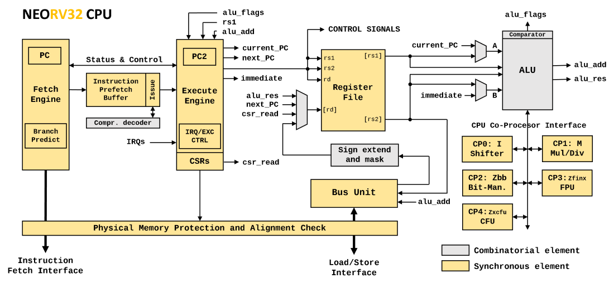

:sectnums:
== NEORV32 Central Processing Unit (CPU)

image:../figures/riscv_logo.png[width=350,align=center]

**Key Features**

* 32-bit pipelined/multi-cycle in-order `rv32` RISC-V CPU
* Optional RISC-V extensions: `rv32[i/e][m][a][c][b][u]` + `[Zfinx][Zicsr][Zifencei]`
* Compatible to the RISC-V user specifications and a subset of the RISC-V privileged architecture specifications – passes the official RISC-V Architecture Tests (v2+)
* Official RISC-V open-source architecture ID
* Standard RISC-V interrupts (_external_, _timer_, _software_) plus 16 _fast_ interrupts and 1 non-maskable interrupt
* Supports most of the traps from the RISC-V specifications (including bus access exceptions) and traps on all unimplemented/illegal/malformed instructions
* Optional physical memory configuration (PMP), compatible to the RISC-V specifications
* Optional hardware performance monitors (HPM) for application benchmarking
* Separated interfaces for instruction fetch and data access (merged into single bus via a bus switch for
the NEORV32 processor)
* BIG-endian byte order
* Configurable hardware reset
* No hardware support of unaligned data/instruction accesses – they will trigger an exception. If the C extension is enabled instructions
can also be 16-bit aligned and a misaligned instruction address exception is not possible anymore

[NOTE]
It is recommended to use the **NEORV32 Processor** as default top instance even if you only want to use the actual
CPU. Simply disable all the processor-internal modules via the generics and you will get a "CPU
wrapper" that provides a minimal CPU environment and an external bus interface (like AXI4). This
setup also allows to further use the default bootloader and software framework. From this base you
can start building your own SoC. Of course you can also use the CPU in it’s true stand-alone mode.

<<<
// ####################################################################################################################
:sectnums:
=== Architecture

The NEORV32 CPU was designed from scratch based only on the official ISA and privileged architecture
specifications. The following figure shows the simplified architecture of the CPU.

The CPU uses a pipelined architecture with basically two main stages. The first stage (IF – instruction fetch)
is responsible for fetching new instruction data from memory via the fetch engine. The instruction data is
stored to a FIFO – the instruction prefetch buffer. The issue engine takes this data and assembles 32-bit
instruction words for the next pipeline stage. Compressed instructions – if enabled – are also decompressed
in this stage. The second stage (EX – execution) is responsible for actually executing the fetched instructions
via the execute engine.

These two pipeline stages are based on a multi-cycle processing engine. So the processing of each stage for a
certain operations can take several cycles. Since the IF and EX stages are decoupled via the instruction
prefetch buffer, both stages can operate in parallel and with overlapping operations. Hence, the optimal CPI
(cycles per instructions) is 2, but it can be significantly higher: For instance when executing loads/stores
multi-cycle operations like divisions or when the instruction fetch engine has to reload the prefetch buffers
due to a taken branch.

Basically, the NEORV32 CPU is somewhere between a classical pipelined architecture, where each stage
requires exactly one processing cycle (if not stalled) and a classical multi-cycle architecture, which executes
every single instruction in a series of consecutive micro-operations. The combination of these two classical
design paradigms allows an increased instruction execution in contrast to a pure multi-cycle approach (due to
the pipelined approach) at a reduced hardware footprint (due to the multi-cycle approach).

The CPU provides independent interfaces for instruction fetch and data access. These two bus interfaces are
merged into a single processor-internal bus via a bus switch. Hence, memory locations including peripheral
devices are mapped to a single 32-bit address space making the architecture a modified Von-Neumann
Architecture.

// ####################################################################################################################
:sectnums:
=== RISC-V Compliance

The NEORV32 CPU passes the rv32_m/I, rv32_m/M, rv32_m/C, rv32_m/privilege, and
rv32_m/Zifencei tests of the official RISC-V Architecture Tests (GitHub). The port files for the
NEORV32 processor are located in riscv-arch-test folder. See section <<_risc_v_architecture_test_framework>> for information how to run
the tests on the NEORV32.

.**RISC-V `rv32_m/C` Tests**
...................................
Check cadd-01           ... OK
Check caddi-01          ... OK
Check caddi16sp-01      ... OK
Check caddi4spn-01      ... OK
Check cand-01           ... OK
Check candi-01          ... OK
Check cbeqz-01          ... OK
Check cbnez-01          ... OK
Check cebreak-01        ... OK
Check cj-01             ... OK
Check cjal-01           ... OK
Check cjalr-01          ... OK
Check cjr-01            ... OK
Check cli-01            ... OK
Check clui-01           ... OK
Check clw-01            ... OK
Check clwsp-01          ... OK
Check cmv-01            ... OK
Check cnop-01           ... OK
Check cor-01            ... OK
Check cslli-01          ... OK
Check csrai-01          ... OK
Check csrli-01          ... OK
Check csub-01           ... OK
Check csw-01            ... OK
Check cswsp-01          ... OK
Check cxor-01           ... OK
--------------------------------
OK: 27/27 RISCV_TARGET=neorv32 RISCV_DEVICE=C XLEN=32
...................................

.**RISC-V `rv32_m/I` Tests**
...................................
Check add-01            ... OK
Check addi-01           ... OK
Check and-01            ... OK
Check andi-01           ... OK
Check auipc-01          ... OK
Check beq-01            ... OK
Check bge-01            ... OK
Check bgeu-01           ... OK
Check blt-01            ... OK
Check bltu-01           ... OK
Check bne-01            ... OK
Check fence-01          ... OK
Check jal-01            ... OK
Check jalr-01           ... OK
Check lb-align-01       ... OK
Check lbu-align-01      ... OK
Check lh-align-01       ... OK
Check lhu-align-01      ... OK
Check lui-01            ... OK
Check lw-align-01       ... OK
Check or-01             ... OK
Check ori-01            ... OK
Check sb-align-01       ... OK
Check sh-align-01       ... OK
Check sll-01            ... OK
Check slli-01           ... OK
Check slt-01            ... OK
Check slti-01           ... OK
Check sltiu-01          ... OK
Check sltu-01           ... OK
Check sra-01            ... OK
Check srai-01           ... OK
Check srl-01            ... OK
Check srli-01           ... OK
Check sub-01            ... OK
Check sw-align-01       ... OK
Check xor-01            ... OK
Check xori-01           ... OK
--------------------------------
OK: 38/38 RISCV_TARGET=neorv32 RISCV_DEVICE=I XLEN=32
...................................

.**RISC-V `rv32_m/M` Tests**
...................................
Check div-01            ... OK
Check divu-01           ... OK
Check mul-01            ... OK
Check mulh-01           ... OK
Check mulhsu-01         ... OK
Check mulhu-01          ... OK
Check rem-01            ... OK
Check remu-01           ... OK
--------------------------------
OK: 8/8 RISCV_TARGET=neorv32 RISCV_DEVICE=M XLEN=32
...................................

.**RISC-V `rv32_m/privilege` Tests**
...................................
Check ebreak            ... OK
Check ecall             ... OK
Check misalign-beq-01   ... OK
Check misalign-bge-01   ... OK
Check misalign-bgeu-01  ... OK
Check misalign-blt-01   ... OK
Check misalign-bltu-01  ... OK
Check misalign-bne-01   ... OK
Check misalign-jal-01   ... OK
Check misalign-lh-01    ... OK
Check misalign-lhu-01   ... OK
Check misalign-lw-01    ... OK
Check misalign-sh-01    ... OK
Check misalign-sw-01    ... OK
Check misalign1-jalr-01 ... OK
Check misalign2-jalr-01 ... OK
--------------------------------
OK: 16/16 RISCV_TARGET=neorv32 RISCV_DEVICE=privilege XLEN=32
...................................

.**RISC-V `rv32_m/Zifencei` Tests**
...................................
Check Fencei            ... OK
--------------------------------
OK: 1/1 RISCV_TARGET=neorv32 RISCV_DEVICE=Zifencei XLEN=32
...................................

<<<
:sectnums:
==== RISC-V Incompatibility Issues and Limitations

This list shows the currently known issues regarding full RISC-V-compatibility. More specific information
can be found in section <<_instruction_sets_and_extensions>>.

[IMPORTANT]
CPU and Processor are BIG-ENDIAN, but this should be no problem as the external memory bus
interface provides big- and little-endian configurations. See section <<_processor_external_memory_interface_wishbone_axi4_lite>> for more information.

[IMPORTANT]
The `misa` CSR is read-only. It shows the synthesized CPU extensions. Hence, all implemented
CPU extensions are always active and cannot be enabled/disabled dynamically during runtime. Any
write access to it (in machine mode) is ignored and will not cause any exception or side-effects.

[IMPORTANT]
The `mip` CSR is read-only. Pending IRQs can be cleared using the `mie` CSR.

[IMPORTANT]
The physical memory protection (see section <<_machine_physical_memory_protection>>)
only supports the modes _OFF_ and _NAPOT_ yet and a minimal granularity of 8 bytes per region.

[IMPORTANT]
The `A` CPU extension (atomic memory access) only implements the `lr.w` and `sc.w` instructions yet.
However, these instructions are sufficient to emulate all further AMO operations.

==== NEORV32-Specific (Custom) Extensions

The NEORV32-specific extensions are always enabled and are indicated by the set `X` bit in the `misa` CSR.

[NOTE]
The CPU provides eight _fast interrupt_ interrupts, which are controlled via custom bit in the `mie`
and `mip` CSR. This extension is mapped to bits, that are available for custom use (according to the
RISC-V specs). Also, custom trap codes for `mcause` are implemented.

[NOTE]
A custom CSR `mzext` is available that can be used to check for implemented `Z*` CPU extensions
(for example `Zifencei`). This CSR is mapped to the official "custom CSR address region".

[NOTE]
All undefined/unimplemented/malformed/illegal instructions do raise an illegal instruction exception
<<_execution_safety>>.

<<<
// ####################################################################################################################
:sectnums:
=== CPU Top Entity - Signals

The following table shows all interface signals of the CPU top entity `rtl/core/neorv32_cpu.vhd`. The
type of all signals is _std_ulogic_ or _std_ulogic_vector_, respectively. The "Dir." column shows the signal
direction seen from the CPU.

.NEORV32 CPU top entity signals
[cols="<2,^1,^1,<6"]
[options="header", grid="rows"]
|=======================
| Signal           | Width | Dir.   | Function
4+^| **Global Signals**
| `clk_i`          |     1 | in  | global clock line, all registers triggering on rising edge
| `rstn_i`         |     1 | in  | global reset, low-active
| `sleep_o`        |     1 | out | CPU is in sleep mode when set
4+^| **Instruction Bus Interface (<<_bus_interface>>)**
| `i_bus_addr_o`   |    32 | out | destination address
| `i_bus_rdata_i`  |    32 | in  | read data
| `i_bus_wdata_o`  |    32 | out | write data (always zero)
| `i_bus_ben_o`    |     4 | out | byte enable
| `i_bus_we_o`     |     1 | out | write transaction (always zero)
| `i_bus_re_o`     |     1 | out | read transaction
| `i_bus_lock_o`   |     1 | out | exclusive access request (always zero)
| `i_bus_ack_i`    |     1 | in  | bus transfer acknowledge from accessed peripheral
| `i_bus_err_i`    |     1 | in  | bus transfer terminate from accessed peripheral
| `i_bus_fence_o`  |     1 | out | indicates an executed _fence.i_ instruction
| `i_bus_priv_o`   |     2 | out | current CPU privilege level
4+^| **Data Bus Interface (<<_bus_interface>>)**
| `d_bus_addr_o`   |    32 | out | destination address
| `d_bus_rdata_i`  |    32 | in  | read data
| `d_bus_wdata_o`  |    32 | out | write data
| `d_bus_ben_o`    |     4 | out | byte enable
| `d_bus_we_o`     |     1 | out | write transaction
| `d_bus_re_o`     |     1 | out | read transaction
| `d_bus_lock_o`   |     1 | out | exclusive access request
| `d_bus_ack_i`    |     1 | in  | bus transfer acknowledge from accessed peripheral
| `d_bus_err_i`    |     1 | in  | bus transfer terminate from accessed peripheral
| `d_bus_fence_o`  |     1 | out | indicates an executed _fence_ instruction
| `d_bus_priv_o`   |     2 | out | current CPU privilege level
4+^| **System Time (see <<_timeh>> CSR)**
| `time_i`         |    64 | in  | system time input (from MTIME)
4+^| **Non-Maskable Interrupt (<<_traps_exceptions_and_interrupts>>)**
| `nm_irq_i`       |     1 | in  | non-maskable interrupt
4+^| **Interrupts, RISC-V-compatible (<<_traps_exceptions_and_interrupts>>)**
| `msw_irq_i`      |     1 | in  | RISC-V machine software interrupt
| `mext_irq_i`     |     1 | in  | RISC-V machine external interrupt
| `mtime_irq_i`    |     1 | in  | RISC-V machine timer interrupt
4+^| **Fast Interrupts, NEORV32-specific (<<_traps_exceptions_and_interrupts>>)**
| `firq_i`         |    16 | in  | fast interrupt request signals
| `firq_ack_o`     |    16 | out | fast interrupt acknowledge signals
4+^| **Enter Debug Mode Request (<<_on_chip_debugger_ocd>>)**
| `db_halt_req_i`  |     1 | in  | request CPU to halt and enter debug mode
|=======================

<<<
// ####################################################################################################################
:sectnums:
=== CPU Top Entity - Generics

Most of the CPU configuration generics are a subset of the actual Processor configuration generics (see section <<_processor_top_entity_generics>>).
and are not listed here. However, the CPU provides some _specific_ generics that are used to configure the CPU for the
NEORV32 processor setup. These generics are assigned by the processor setup only and are not available for user defined configuration.
The _specific_ generics are listed below.

[cols="4,4,2"]
[frame="all",grid="none"]
|======
| **CPU_BOOT_ADDR** | _std_ulogic_vector(31 downto 0)_ | 0x00000000
3+| This address defines the reset address at which the CPU starts fetching instructions after reset. In terms of the NEORV32 processor, this
generic is configured with the base address of the bootloader ROM (default) or with the base address of the processor-internal instruction
memory (IMEM) if the bootloader is disabled (_BOOTLOADER_EN_ = _false_). See section <<_address_space>> for more information.
|======

[cols="4,4,2"]
[frame="all",grid="none"]
|======
| **CPU_DEBUG_ADDR** | _std_ulogic_vector(31 downto 0)_ | 0x00000000
3+| This address defines the entry address for the "execution based" on-chip debugger. By default, this generic is configured with the base address
of the debugger memory. See section <<_on_chip_debugger_ocd>> for more information.
|======

[cols="4,4,2"]
[frame="all",grid="none"]
|======
| **CPU_EXTENSION_RISCV_DEBUG** | _boolean_ | false
3+| Implement RISC-V-compatible "debug" CPU operation mode. See section <<_cpu_debug_mode>> for more information.
|======

<<<
// ####################################################################################################################
:sectnums:
=== Instruction Sets and Extensions

The NEORV32 is an RISC-V `rv32i` architecture that provides several optional RISC-V CPU and ISA
(instruction set architecture) extensions. For more information regarding the RISC-V ISA extensions please
see the The _RISC-V Instruction Set Manual – Volume I: Unprivileged ISA_ and _The RISC-V Instruction Set Manual
Volume II: Privileged Architecture_, which are available in the projects `docs/` folder.

==== **`A`** - Atomic Memory Access

Atomic memory access instructions (for implementing semaphores and mutexes) are available when the
`CPU_EXTENSION_RISCV_A` configuration generic is _true_. In this case the following additional instructions
are available:

* `lr.w`: load-reservate
* `sc.w`: store-conditional

[NOTE]
Even though only `lr.w` and `sc.w` instructions are implemented yet, all further atomic operations
(load-modify-write instruction) can be emulated using these two instruction. Furthermore, the
instruction’s ordering flags (`aq` and `lr`) are ignored by the CPU hardware. Using any other (not yet
implemented) AMO (atomic memory operation) will trigger an illegal instruction exception.

[NOTE]
The atomic instructions have special requirements for memory system / bus interconnect. More
information can be found in sections <<_bus_interface>> and <<_processor_external_memory_interface_wishbone_axi4_lite>>, respectively.

==== **`B`** - Bit-Manipulation

The bit-manipulation instructions extension are available when the `CPU_EXTENSION_RISCV_B` configuration generic
is _true_. Note that not all sub-extensions are implemented yet. When the bit-manipulation extension is enabled
the following instructions are available:

* base subset **`Zbb`**: `clz`, `ctz`, `cpop`, `sext.b`, `sext.h`, `min[u]`, `max[u]`, `andn`, `orn`, `xnor`, `rol`, `ror`,
`rori`, `c.xor`, `zext` (_pseudo instruction_ `for pack rd, rs, zero`), `rev8` (_pseudo instruction_ for `grevi rd, rs, -8`),
`orc.b` (_pseudo instruction_ for `gorci rd, rs, 7`)
* single-bit operations **`Zbs`**: `sbset[i]`, `sbclr[i]`, `sbclr[i]`, `sbext[i]`
* shifted-add operations **`Zba`**: `sh1add`, `sh2add`, `sh3add`

[WARNING]
The bit manipulation extension is not yet officially ratified and the NEORV32 implementation is still
_work-in-progess_. There is no software support in the upstream GCC RISC-V port yet. However, an intrinsic library
is provided to utilize the provided bit manipulation extension from C-language code (see
`sw/example/bit_manipulation`).

[NOTE]
The current version of the bit manipulation specs that are supported by the NEORV32 can be found
in `docs/bitmanip-draft.pdf`.

==== **`C`** - Compressed Instructions

Compressed 16-bit instructions are available when the `CPU_EXTENSION_RISCV_C` configuration generic is
_true_. In this case the following instructions are available:

* `c.addi4spn`, `c.lw`, `c.sw`, `c.nop`, `c.addi`, `c.jal`, `c.li`, `c.addi16sp`, `c.lui`, `c.srli`, `c.srai` `c.andi`, `c.sub`,
`c.xor`, `c.or`, `c.and`, `c.j`, `c.beqz`, `c.bnez`, `c.slli`, `c.lwsp`, `c.jr`, `c.mv`, `c.ebreak`, `c.jalr`, `c.add`, `c.swsp`

[NOTE]
When the compressed instructions extension is enabled, branches to an _unaligned_ and _uncompressed_ address require
an additional instruction fetch to load the required second half-word of that instruction. The performance can be increased
again by forcing a 32-bit alignment of branch target addresses. By default, this is enforced via the GCC `-falign-functions=4`,
`-falign-labels=4`, `-falign-loops=4` and `-falign-jumps=4` compile flags (via the makefile).

==== **`E`** - Embedded CPU

The embedded CPU extensions reduces the size of the general purpose register file from 32 entries to 16 entries to reduce hardware
requirements. This extensions is enabled when the `CPU_EXTENSION_RISCV_E` configuration generic is _true_. Accesses to registers beyond
`x15` will raise and _illegal instruction exception_.

Due to the reduced register file an alternate ABI (**`ilp32e`**) is required for the toolchain.

==== **`I`** - Base Integer ISA
The CPU always supports the complete `rv32i` base integer instruction set. This base set is always enabled
regardless of the setting of the remaining exceptions. The base instruction set includes the following
instructions:

* immediates: `lui`, `auipc`
* jumps: `jal`, `jalr`
* branches: `beq`, `bne`, `blt`, `bge`, `bltu`, `bgeu`
* memory: `lb`, `lh`, `lw`, `lbu`, `lhu`, `sb`, `sh`, `sw`
* alu: `addi`, `slti`, `sltiu`, `xori`, `ori`, `andi`, `slli`, `srli`, `srai`, `add`, `sub`, `sll`, `slt`, `sltu`, `xor`, `srl`, `sra`, `or`, `and`
* environment: `ecall`, `ebreak`, `fence`

[NOTE]
In order to keep the hardware footprint low, the CPU's shift unit uses a hybrid parallel/serial approach. Shift
operations are split in coarse shifts (multiples of 4) and a final fine shift (0 to 3). The total execution
time depends on the shift amount. Alternatively, the shift operations can be processed completely in parallels by a fast
(but large) barrel shifter when the `FAST_SHIFT_EN` generic is _true_. In that case, shift operations
complete within 2 cycles regardless of the shift amount. Shift operations can also be executed in a pure serial manner when
then `TINY_SHIFT_EN` generic is _true_. In that case, shift operations take up to 32 cycles depending on the shift amount.

[NOTE]
Internally, the `fence` instruction does not perform any operation inside the CPU. It only sets the
top’s `d_bus_fence_o` signal high for one cycle to inform the memory system a `fence` instruction has been
executed. Any flags within the `fence` instruction word are ignore by the hardware.

==== **`M`** - Integer Multiplication and Division

Hardware-accelerated integer multiplication and division instructions are available when the
`CPU_EXTENSION_RISCV_M` configuration generic is _true_. In this case the following instructions are
available:

• multiplication: `mul`, `mulh`, `mulhsu`, `mulhu`
• division: `div`, `divu`, `rem`, `remu`

[NOTE]
By default, multiplication and division operations are executed in a bit-serial approach.
Alternatively, the multiplier core can be implemented using DSP blocks if the `FAST_MUL_EN`
generic is _true_ allowing faster execution. Multiplications and divisions
always require a fixed amount of cycles to complete - regardless of the input operands.

==== **`U`** - Less-Privileged User Mode

Adds the less-privileged _user mode_ when the `CPU_EXTENSION_RISCV_U` configuration generic is _true_. For
instance, use-level code cannot access machine-mode CSRs. Furthermore, access to the address space (like
peripheral/IO devices) can be limited via the physical memory protection (_PMP_) unit for code running in user mode.

==== **`Zfinx`** Single-Precision Floating-Point Operations

The `Zfinx` floating-point extension is an alternative of the `F` floating-point instruction that also uses the
integer register file `x` to store and operate on floating-point data (hence, `F-in-x`). Since not dedicated floating-point `f`
register file exists, the `Zfinx` extension requires less hardware resources and features faster context changes.
This also implies that there are NO dedicated `f` register file related load/store or move instructions. The
official RISC-V specifications can be found here: https://github.com/riscv/riscv-zfinx

The NEORV32 floating-point unit used by the `Zfinx` extension is compatible to the _IEEE-754_ specifications.

The `Zfinx` extensions only supports single-precision (`.s` suffix) yet (so it is a direct alternative to the `F`
extension). The `Zfinx` extension is implemented when the `CPU_EXTENSION_RISCV_Zfinx` configuration
generic is _true_. In this case the following instructions and CSRs are available:

* conversion: `fcvt.s.w`, `fcvt.s.wu`, `fcvt.w.s`, `fcvt.wu.s`
* comparison: `fmin.s`, `fmax.s`, `feq.s`, `flt.s`, `fle.s`
* computational: `fadd.s`, `fsub.s`, `fmul.s`
* sign-injection: `fsgnj.s`, `fsgnjn.s`, `fsgnjx.s`
* number classification: `fclass.s`

* additional CSRs: `fcsr`, `frm`, `fflags`

[WARNING]
Fused multiply-add instructions `f[n]m[add/sub].s` are not supported!
Division `fdiv.s` and square root `fsqrt.s` instructions are not supported yet!

[WARNING]
Subnormal numbers (also "de-normalized" numbers) are not supported by the NEORV32 FPU.
Subnormal numbers (exponent = 0) are _flushed to zero_ (setting them to +/- 0) before entering the
FPU's processing core. If a computational instruction (like `fmul.s`) generates a subnormal result, the
result is also flushed to zero during normalization.

[WARNING]
The `Zfinx` extension is not yet officially ratified, but is expected to stay unchanged. There is no
software support for the `Zfinx` extension in the upstream GCC RISC-V port yet. However, an
intrinsic library is provided to utilize the provided `Zfinx` floating-point extension from C-language
code (see `sw/example/floating_point_test`).

==== **`Zicsr`** Control and Status Register Access / Privileged Architecture

The CSR access instructions as well as the exception and interrupt system (= the privileged architecture) is implemented when the
`CPU_EXTENSION_RISCV_Zicsr` configuration generic is _true_. In this case the following instructions are
available:

* CSR access: `csrrw`, `csrrs`, `csrrc`, `csrrwi`, `csrrsi`, `csrrci`
* environment: `mret`, `wfi`

[WARNING]
If the `Zicsr` extension is disabled the CPU does not provide any kind of interrupt or exception
support at all. In order to provide the full spectrum of functions and to allow a secure executions
environment, the `Zicsr` extension should always be enabled.

[NOTE]
The "wait for interrupt instruction" `wfi` works like a sleep command. When executed, the CPU is
halted until a valid interrupt request occurs. To wake up again, the according interrupt source has to
be enabled via the `mie` CSR and the global interrupt enable flag in `mstatus` has to be set.

==== **`Zifencei`** Instruction Stream Synchronization

The `Zifencei` CPU extension is implemented if the `CPU_EXTENSION_RISCV_Zifencei` configuration
generic is _true_. It allows manual synchronization of the instruction stream via the following instruction:

* `fence.i`

[NOTE]
The `fence.i` instruction resets the CPU's internal instruction fetch engine and flushes the prefetch buffer.
This allows a clean re-fetch of modified data from memory. Also, the top's `i_bus_fencei_o` signal is set
high for one cycle to inform the memory system. Any additional flags within the `fence.i` instruction word are ignore by the hardware.
If _CPU_EXTENSION_RISCV_Zifencei_ is false, executing `fence.i` will **not trap** and none of the described functions will be executed.

==== **`PMP`** Physical Memory Protection

The NEORV32 physical memory protection (PMP) is compatible to the PMP specified by the RISC-V specs.
The CPU PMP only supports _NAPOT_ mode yet and a minimal region size (granularity) of 8 bytes. Larger minimal sizes can be configured
via the top `PMP_MIN_GRANULARITY` generic to reduce hardware requirements. The physical memory protection system is implemented when the
`PMP_NUM_REGIONS` configuration generic is >0. In this case the following additional CSRs are available:

* `pmpcfg*` (0..15, depending on configuration): PMP configuration registers
* `pmpaddr*` (0..63, depending on configuration): PMP address registers

See section <<_machine_physical_memory_protection>> for more information regarding the PMP CSRs.

**Configuration**

The actual number of regions and the minimal region granularity are defined via the top entity
`PMP_MIN_GRANULARITY` and `PMP_NUM_REGIONS` generics. `PMP_MIN_GRANULARITY` defines the minimal available
granularity of each region in bytes. `PMP_NUM_REGIONS` defines the total number of implemented regions and thus, the
number of available `pmpcfg*` and `pmpaddr*` CSRs.

When implementing more PMP regions that a _certain critical limit_ *an additional register stage
is automatically inserted* into the CPU's memory interfaces to reduce critical path length. Unfortunately, this will also
increase the latency of instruction fetches and data access by +1 cycle.

The critical limit can be adapted for custom use by a constant from the main VHDL package file
(`rtl/core/neorv32_package.vhd`). The default value is 8:

[source,vhdl]
----
-- "critical" number of PMP regions --
constant pmp_num_regions_critical_c : natural := 8;
----

**Operation**

Any memory access address (from the CPU's instruction fetch or data access interface) is tested if it is accessing any
of the specified (configured via `pmpaddr*` and enabled via `pmpcfg*`) PMP regions. If an
address accesses one of these regions, the configured access rights (attributes in `pmpcfg*`) are checked:

* a write access (store) will fail if no write attribute is set
* a read access (load) will fail if no read attribute is set
* an instruction fetch access will fail if no execute attribute is set

If an access to a protected region does not have the according access rights (attributes) it will raise the according
_instruction/load/store access fault exception_.

By default, all PMP checks are enforced for user-level programs only. If you wish to enforce the physical
memory protection also for machine-level programs you need to active the _locked bit_ in the according
`pmpcfg*` configuration.

[IMPORTANT]
After updating the address configuration registers `pmpaddr*` the system requires up to 33 cycles for
internal (iterative) computations before the configuration becomes valid.

[NOTE]
For more information regarding RISC-V physical memory protection see the official _The RISC-V
Instruction Set Manual – Volume II: Privileged Architecture_ specifications.

==== **`HPM`** Hardware Performance Monitors

In additions to the mandatory cycles (`[m]cycle[h]`) and instruction (`[m]instret[h]`) counters the NEORV32 CPU provides
up to 29 hardware performance monitors (HPM 3..31), which can be used to benchmark applications. Each HPM consists of an
N-bit wide counter (split in a high-word 32-bit CSR and a low-word 32-bit CSR), where N is defined via the top's
`HPM_CNT_WIDTH` generic (1..64-bit), and a corresponding event configuration CSR. The event configuration
CSR defines the architectural events that lead to an increment of the associated HPM counter.

The cycle, time and instructions-retired counters (`[m]cycle[h]`, `time[h]`, `[m]instret[h]`) are
mandatory performance monitors on every RISC-V platform and have fixed increment event. For example,
the instructions-retired counter increments with each executed instructions. The actual hardware performance
monitors are optional and can be configured to increment on arbitrary hardware events. The number of
available HPM is configured via the top's `HPM_NUM_CNTS` generic at synthesis time. Assigning a zero will exclude
all HPM logic from the design.

Depending on the configuration, the following additional CSR are available:

* counters: `[m]hpmcounter*[h]` (3..31, depending on configuration)
* event configuration: `mhpmevent*` (3..31, depending on configuration)

User-level access to the counter registers `hpmcounter*[h]` can be individually restricted via the `mcounteren` CSR.
Auto-increment of the HPMs can be individually deactivated via the `mcountinhibit` CSR.

If `HPM_NUM_CNTS` is lower than the maximumg value (=29) the remaining HPMs are not implemented.
However, accessing their associated CSRs will not raise an illegal instructions exception. These CSR are
read-only and will always return 0.

[NOTE]
For a list of all allocated HPM-related CSRs and all provided event configurations see section <<_hardware_performance_monitors_hpm>>.

<<<
// ####################################################################################################################
:sectnums:
=== Instruction Timing

The instruction timing listed in the table below shows the required clock cycles for executing a certain
instruction. These instruction cycles assume a bus access without additional wait states and a filled
pipeline.

Average CPI (cycles per instructions) values for "real applications" like for executing the CoreMark benchmark for different CPU
configurations are presented in <<_cpu_performance>>.

.Clock cycles per instruction
[cols="<2,^1,^4,<3"]
[options="header", grid="rows"]
|=======================
| Class | ISA | Instruction(s) | Execution cycles
| ALU           | `I/E` | `addi` `slti` `sltiu` `xori` `ori` `andi` `add` `sub` `slt` `sltu` `xor` `or` `and` `lui` `auipc` | 2
| ALU           | `C`   | `c.addi4spn` `c.nop` `c.addi` `c.li` `c.addi16sp` `c.lui` `c.andi` `c.sub` `c.xor` `c.or` `c.and` `c.add` `c.mv` | 2
| ALU           | `I/E` | `slli` `srli` `srai` `sll` `srl` `sra` | 3 + SAfootnote:[Shift amount.]/4 + SA%4; FAST_SHIFTfootnote:[Barrel shift when `FAST_SHIFT_EN` is enabled.]: 4; TINY_SHIFTfootnote:[Serial shift when `TINY_SHIFT_EN` is enabled.]: 2..32
| ALU           | `C`   | `c.srli` `c.srai` `c.slli` | 3 + SAfootnote:[Shift amount.]/4 + SA%4; FAST_SHIFTfootnote:[Barrel shift when `FAST_SHIFT_EN` is enabled.]: 4; TINY_SHIFTfootnote:[Serial shift when `TINS_SHIFT_EN` is enabled.]: 2..32
| Branches      | `I/E` | `beq` `bne` `blt` `bge` `bltu` `bgeu` | Taken: 5 + MLfootnote:[Memory latency.]; Not taken: 3
| Branches      | `C`   | `c.beqz` `c.bnez`                     | Taken: 5 + MLfootnote:[Memory latency.]; Not taken: 3
| Jumps / Calls | `I/E` | `jal` `jalr`                  | 4 + ML
| Jumps / Calls | `C`   | `c.jal` `c.j` `c.jr` `c.jalr` | 4 + ML
| Memory access | `I/E` | `lb` `lh` `lw` `lbu` `lhu` `sb` `sh` `sw` | 4 + ML
| Memory access | `C`   | `c.lw` `c.sw` `c.lwsp` `c.swsp`           | 4 + ML
| Memory access | `A`   | `lr.w` `sc.w`                             | 4 + ML
| Multiplication | `M`  | `mul` `mulh` `mulhsu` `mulhu` | 2+31+3; FAST_MULfootnote:[DSP-based multiplication; enabled via `FAST_MUL_EN`.]: 5
| Division       | `M`  | `div` `divu` `rem` `remu`     | 22+32+4
| Bit-manipulation - arithmetic/logic | `B(Zbb)` | `sext.b` `sext.h` `min` `minu` `max` `maxu` `andn` `orn` `xnor` `zext`(pack) `rev8`(grevi) `orc.b`(gorci) | 3
| Bit-manipulation - shifts | `B(Zbb)` | `clz` `ctz` | 3 + 0..32
| Bit-manipulation - shifts | `B(Zbb)` | `cpop` | 3 + 32
| Bit-manipulation - shifts | `B(Zbb)` | `rol` `ror` `rori` | 3 + SA
| Bit-manipulation - single-bit | `B(Zbs)` | `sbset[i]` `sbclr[i]` `sbinv[i]` `sbext[i]` | 3
| Bit-manipulation - shifted-add | `B(Zba)` | `sh1add` `sh2add` `sh3add` | 3
| CSR access | `Zicsr` | `csrrw` `csrrs` `csrrc` `csrrwi` `csrrsi` `csrrci` | 4
| System | `I/E`+`Zicsr` | `ecall` `ebreak` | 4
| System | `I/E` | `fence` | 3
| System | `C`+`Zicsr` | `c.break` | 4
| System | `Zicsr` | `mret` `wfi` | 5
| System | `Zifencei` | `fence.i` | 5
| Floating-point - artihmetic | `Zfinx` | `fadd.s` | 110
| Floating-point - artihmetic | `Zfinx` | `fsub.s` | 112
| Floating-point - artihmetic | `Zfinx` | `fmul.s` | 22
| Floating-point - compare | `Zfinx` | `fmin.s` `fmax.s` `feq.s` `flt.s` `fle.s` | 13
| Floating-point - misc | `Zfinx` | `fsgnj.s` `fsgnjn.s` `fsgnjx.s` `fclass.s` | 12
| Floating-point - conversion | `Zfinx` | `fcvt.w.s` `fcvt.wu.s` | 47
| Floating-point - conversion | `Zfinx` | `fcvt.s.w` `fcvt.s.wu` | 48
|=======================

[NOTE]
The presented values of the *floating-point execution cycles* are average values – obtained from
4096 instruction executions using pseudo-random input values. The execution time for emulating the
instructions (using pure-software libraries) is ~17..140 times higher.

// ####################################################################################################################
include::cpu_csr.adoc[]

<<<
// ####################################################################################################################
:sectnums:
==== Execution Safety

The hardware of the NEORV32 CPU was designed for maximum *execution safety*. If the `Zicsr` CPU
extension is enabled, the core supports **all** traps specified by the official RISC-V specifications (obviously,
not the ones that are related to yet unimplemented extensions/features). Thus, the CPU provides well-defined
hardware fall-backs for (nearly) everything that can go wrong. Even if any kind of trap is triggered, the core
is always in a defined and fully synchronized state throughout the whole architecture (i.e. no need to make
out-of-order operations undone) that allows predictable execution behavior at any time.

**Core Safety Features**

* Due to the acknowledged memory accesses the CPU is _always_ sync with the memory system (no speculative execution / out-of-order states).
* The CPU supports all bus exceptions including bus access exceptions that are triggered if an
accessed address does not respond or encounters an internal error during access (which is a rare
feature in many open-source RISC-V cores).
* The CPU raises an illegal instruction trap for **all** unimplemented/malformed/illegal instructions (to support _full_ virtualization).
* If user-level code tries to read from machine-level-only CSRs (like `mstatus`) an illegal instruction
exception is raised. The results of this operations is always zero (though, machine-level
code handling this exception can modify the target register of the illegal access-causing
instruction to allow full virtualization). Illegal write accesses to machine CSRs will not be write any data at all.
* Illegal user-level memory accesses to protected addresses or address regions (via physical memory
protection) will not be conducted at all (no actual write and no actual read; prevents triggering of
memory-mapped devices). Illegal load operations will not return any data (the instruction's
destination register will not be written at all).

<<<
// ####################################################################################################################
:sectnums:
==== Traps, Exceptions and Interrupts

In this document a (maybe) special nomenclature regarding traps is used:

* _interrupt_ = asynchronous exceptions
* _exceptions_ = synchronous exceptions
* _traps_ = exceptions + interrupts (synchronous or asynchronous exceptions)

Whenever an exception or interrupt is triggered, the CPU transfers control to the address stored in the `mtvec`
CSR. The cause of the according interrupt or exception can be determined via the content of the `mcause`
CSR The address that reflected the current program counter when a trap was taken is stored to `mepc`.
Additional information regarding the cause of the trap can be retrieved from `mtval`.

The traps are prioritized. If several exceptions occur at once only the one with highest priority is triggered. If
several interrupts trigger at once, the one with highest priority is triggered while the remaining ones are
queued. After completing the interrupt handler the interrupt with the second highest priority will issues and
so on.

**Memory Access Exceptions**

If a load operation causes any exception, the destination register is not written at all. Exceptions caused by a
misalignment or a physical memory protection fault do not trigger a bus read-operation at all.
Exceptions caused by a store address misalignment or a store physical memory protection fault do not trigger
a bus write-operation at all.

**Instruction Atomicity**

All instructions execute as atomic operations – interrupts can only trigger between two instructions.

**Custom Fast Interrupt Request Lines**

As a custom extension, the NEORV32 CPU features 16 fast interrupt request lines via the `firq_i` CPU (/Processor) top
entity signals. These interrupts have custom configuration and status flags in the `mie` and `mip` CSRs and also
provide custom trap codes in `mcause`.

**Non-Maskable Interrupt**

The NEORV32 CPU features a single non-maskable interrupt source via the `nm_irq_i` CPU (/Processor) top
entity signal that can be used to signal critical system conditions. This interrupt source _cannot_ be disabled at all (even not in interrupt service routines).
Hence, it does _not_ provide configuration/status flags in the `mie` and `mip` CSRs. The RISC-V-compatible
`mcause` value `0x80000000` is used to indicate the non-maskable interrupt.

[IMPORTANT]
All CPU/Processor interrupt request signals are triggered when the signal is _high_ for exactly one cycle (being high for several cycles might
cause multiple triggering of the interrupt).

<<<
// ####################################################################################################################
:sectnums!:
===== NEORV32 Trap Listing

.NEORV32 trap listing
[cols="3,6,5,14,11,4,4"]
[options="header",grid="rows"]
|=======================
| Prio. | `mcause`     | [RISC-V] | ID [C] | Cause | `mepc` | `mtval`
| 1     | `0x80000000` | 1.0      | _TRAP_CODE_NMI_ | non-maskable interrupt | _I-PC_ | _0_
| 2     | `0x8000000B` | 1.11     | _TRAP_CODE_MEI_ | machine external interrupt | _I-PC_ | _0_
| 3     | `0x80000003` | 1.3      | _TRAP_CODE_MSI_ | machine software interrupt | _I-PC_ | _0_
| 4     | `0x80000007` | 1.7      | _TRAP_CODE_MTI_ | machine timer interrupt | _I-PC_ | _0_
| 5     | `0x80000010` | 1.16     | _TRAP_CODE_FIRQ_0_ | fast interrupt request channel | _I-PC_ | _0_
| 6     | `0x80000011` | 1.17     | _TRAP_CODE_FIRQ_1_ | fast interrupt request channel | _I-PC_ | _0_
| 7     | `0x80000012` | 1.18     | _TRAP_CODE_FIRQ_2_ | fast interrupt request channel | _I-PC_ | _0_
| 8     | `0x80000013` | 1.19     | _TRAP_CODE_FIRQ_3_ | fast interrupt request channel | _I-PC_ | _0_
| 9     | `0x80000014` | 1.20     | _TRAP_CODE_FIRQ_4_ | fast interrupt request channel | _I-PC_ | _0_
| 10    | `0x80000015` | 1.21     | _TRAP_CODE_FIRQ_5_ | fast interrupt request channel | _I-PC_ | _0_
| 11    | `0x80000016` | 1.22     | _TRAP_CODE_FIRQ_6_ | fast interrupt request channel | _I-PC_ | _0_
| 12    | `0x80000017` | 1.23     | _TRAP_CODE_FIRQ_7_ | fast interrupt request channel | _I-PC_ | _0_
| 13    | `0x80000018` | 1.24     | _TRAP_CODE_FIRQ_8_ | fast interrupt request channel | _I-PC_ | _0_
| 14    | `0x80000019` | 1.25     | _TRAP_CODE_FIRQ_9_ | fast interrupt request channel | _I-PC_ | _0_
| 15    | `0x8000001a` | 1.26     | _TRAP_CODE_FIRQ_10_ | fast interrupt request channel | _I-PC_ | _0_
| 16    | `0x8000001b` | 1.27     | _TRAP_CODE_FIRQ_11_ | fast interrupt request channel | _I-PC_ | _0_
| 17    | `0x8000001c` | 1.28     | _TRAP_CODE_FIRQ_12_ | fast interrupt request channel | _I-PC_ | _0_
| 18    | `0x8000001d` | 1.29     | _TRAP_CODE_FIRQ_13_ | fast interrupt request channel | _I-PC_ | _0_
| 19    | `0x8000001e` | 1.30     | _TRAP_CODE_FIRQ_14_ | fast interrupt request channel | _I-PC_ | _0_
| 20    | `0x8000001f` | 1.31     | _TRAP_CODE_FIRQ_15_ | fast interrupt request channel | _I-PC_ | _0_
| 21    | `0x00000001` | 0.1      | _TRAP_CODE_I_ACCESS_ | instruction access fault | _B-ADR_ | _PC_
| 22    | `0x00000002` | 0.2      | _TRAP_CODE_I_ILLEGAL_ | illegal instruction | _PC_ | _Inst_
| 23    | `0x00000000` | 0.0      | _TRAP_CODE_I_MISALIGNED_ | instruction address misaligned | _B-ADR_ | _PC_
| 24    | `0x0000000B` | 0.11     | _TRAP_CODE_MENV_CALL_ | environment call from M-mode (ECALL in machine-mode) | _PC_ | _PC_
| 25    | `0x00000008` | 0.8      | _TRAP_CODE_UENV_CALL_ | environment call from U-mode(ECALL in user-mode) | _PC_ | _PC_
| 26    | `0x00000003` | 0.3      | _TRAP_CODE_BREAKPOINT_ | breakpoint (EBREAK) | _PC_ | _PC_
| 27    | `0x00000006` | 0.6      | _TRAP_CODE_S_MISALIGNED_ | store address misaligned | _B-ADR_ | _B-ADR_
| 28    | `0x00000004` | 0.4      | _TRAP_CODE_L_MISALIGNED_ | load address misaligned | _B-ADR_ | _B-ADR_
| 29    | `0x00000007` | 0.7      | _TRAP_CODE_S_ACCESS_ | store access fault | _B-ADR_ | _B-ADR_
| 30    | `0x00000005` | 0.5      | _TRAP_CODE_L_ACCESS_ | lad access fault | _B-ADR_ | _B-ADR_
|=======================

**Notes**

The "Prio." column shows the priority of each trap. The highest priority is 1. The "`mcause`" column shows the
cause ID of the according trap that is written to `mcause` CSR. The "[RISC-V]" columns show the interrupt/exception code value from the
official RISC-V privileged architecture manual. The "[C]" names are defined by the NEORV32 core library (`sw/lib/include/neorv32.h`) and can
be used in plain C code. The "`mepc`" and "`mtval`" columns show the value written to
`mepc` and `mtval` CSRs when a trap is triggered:

* _I-PC_ - address of interrupted instruction (instruction has not been execute/completed yet)
* _B-ADR_- bad memory access address that cause the trap
* _PC_ - address of instruction that caused the trap
* _0_ - zero
* _Inst_ - the faulting instruction itself

<<<
// ####################################################################################################################
:sectnums:
==== Bus Interface

The CPU provides two independent bus interfaces: One for fetching instructions (`i_bus_*`) and one for
accessing data (`d_bus_*`) via load and store operations. Both interfaces use the same interface protocol.

:sectnums:
===== Address Space

The CPU is a 32-bit architecture with separated instruction and data interfaces making it a Harvard
Architecture. Each of this interfaces can access an address space of up to 2^32^ bytes (4GB). The memory
system is based on 32-bit words with a minimal granularity of 1 byte. Please note, that the NEORV32 CPU
does not support unaligned memory accesses _in hardware_ – however, a software-based handling can be
implemented as any unaligned memory access will trigger an according exception.

:sectnums:
===== Interface Signals

The following table shows the signals of the data and instruction interfaces seen from the CPU
(`*_o` signals are driven by the CPU / outputs, `*_i` signals are read by the CPU / inputs).

.CPU bus interface
[cols="<2,^1,<7"]
[options="header",grid="rows"]
|=======================
| Signal | Size | Function
| `bus_addr_o`   | 32 | access address
| `bus_rdata_i`  | 32 | data input for read operations
| `bus_wdata_o`  | 32 | data output for write operations
| `bus_ben_o`    | 4  | byte enable signal for write operations
| `bus_we_o`     | 1  | bus write access
| `bus_re_o`     | 1  | bus read access
| `bus_lock_o`   | 1  | exclusive access request
| `bus_ack_i`    | 1  | accessed peripheral indicates a successful completion of the bus transaction
| `bus_err_i`    | 1  | accessed peripheral indicates an error during the bus transaction
| `bus_fence_o`  | 1  | this signal is set for one cycle when the CPU executes a data/instruction fence operation
| `bus_priv_o`   | 2  | current CPU privilege level
|=======================

[NOTE]
Currently, there a no pipelined or overlapping operations implemented within the same bus interface.
So only a single transfer request can be "on the fly".

:sectnums:
===== Protocol

A bus request is triggered either by the `bus_re_o` signal (for reading data) or by the `bus_we_o` signal (for
writing data). These signals are active for exactly one cycle and initiate either a read or a write transaction. The transaction is
completed when the accessed peripheral either sets the `bus_ack_i` signal (-> successful completion) or the
`bus_err_i` signal is set (-> failed completion). All these control signals are only active (= high) for one
single cycle. An error indicated via the `bus_err_i` signal during a transfer will trigger the according instruction bus
access fault or load/store bus access fault exception.

[NOTE]
The transfer can be completed directly in the same cycle as it was initiated (via the `bus_re_o` or `bus_we_o`
signal) if the peripheral sets `bus_ack_i` or `bus_err_i` high for one cycle. However, in order to shorten the critical path such "asynchronous"
completion should be avoided. The default processor-internal module provide exactly **one cycle delay** between initiation and completion of transfers.

.Bus Keeper: Processor-internal memories and memory-mapped devices with variable / high latency
[IMPORTANT]
Processor-internal peripherals or memories do not have to respond within one cycle after the transfer initiation (= latency > 1 cycle). 
However, the bus transaction has to be completed (= acknowledged) within a certain **response time window**. This time window is defined
by the global `max_proc_int_response_time_c` constant (default = 15 cycles) from the processor's VHDL package file (`rtl/neorv32_package.vhd`).
It defines the maximum number of cycles after which an _unacknowledged_ processor-internal bus transfer will timeout and raise a **bus fault exception**.
The _BUSKEEPER_ hardware module (`rtl/core/neorv32_bus_keeper.vhd`) keeps track of all _internal_ bus transactions. If any bus operations times out
(for example when accessing "address space holes") this unit will issue a bus error to the CPU that will raise the according instruction fetch or data access bus exception.
Note that **the bus keeper does not track external accesses via the external memory bus interface**. However, the external memory bus interface also provides
an _optional_ bus timeout (see section <<_processor_external_memory_interface_wishbone_axi4_lite>>).

**Exemplary Bus Accesses**

.Example bus accesses: see read/write access description below
[cols="^2,^2"]
[grid="none"]
|=======================
| image:../figures/cpu_interface_read_long.png[read,300,150] +
Read access
| image:../figures/cpu_interface_write_long.png[write,300,150] +
Write access
|=======================

**Write Access**

For a write access, the accessed address (`bus_addr_o`), the data to be written (`bus_wdata_o`) and the byte
enable signals (`bus_ben_o`) are set when bus_we_o goes high. These three signals are kept stable until the
transaction is completed. In the example the accessed peripheral cannot answer directly in the next
cycle after issuing. Here, the transaction is successful and the peripheral sets the `bus_ack_i` signal several
cycles after issuing.

**Read Access**

For a read access, the accessed address (`bus_addr_o`) is set when `bus_re_o` goes high. The address is kept
stable until the transaction is completed. In the example the accessed peripheral cannot answer
directly in the next cycle after issuing. The peripheral hast to apply the read data right in the same cycle as
the bus transaction is completed (here, the transaction is successful and the peripheral sets the `bus_ack_i`
signal).

**Access Boundaries**

The instruction interface will always access memory on word (= 32-bit) boundaries even if fetching
compressed (16-bit) instructions. The data interface can access memory on byte (= 8-bit), half-word (= 16-
bit) and word (= 32-bit) boundaries.

**Exclusive (Atomic) Access**

The CPU can access memory in an exclusive manner by generating a load-reservate and store-conditional
combination. Normally, these combinations should target the same memory address.

The CPU starts an exclusive access to memory via the _load-reservate instruction_ (`lr.w`). This instruction
will set the CPU-internal _exclusive access lock_, which directly drives the `d_bus_lock_o`. It is the task of
the memory system to manage this exclusive access reservation by storing the according access address and
the source of the access itself (for example via the CPU ID in a multi-core system).

When the CPU executes a _store-conditional instruction_ (`sc.w`) the _CPU-internal exclusive access lock_ is
evaluated to check if the exclusive access was successful. If the lock is still OK, the instruction will write-back
zero and will allow the according store operation to the memory system. If the lock is broken, the
instruction will write-back non-zero and will not generate an actual memory store operation.

The CPU-internal exclusive access lock is broken if at least one of the situations appear.

* when executing any other memory-access operation than `lr.w`
* when any trap (sync. or async.) is triggered (for example to force a context switch)
* when the memory system signals a bus error (via the `bus_err_i` signal)

[TIP]
For more information regarding the SoC-level behavior and requirements of atomic operations see
section <<_processor_external_memory_interface_wishbone_axi4_lite>>.

**Memory Barriers**

Whenever the CPU executes a fence instruction, the according interface signal is set high for one cycle
(`d_bus_fence_o` for a _fence_ instruction; `i_bus_fence_o` for a _fencei_ instruction). It is the task of the
memory system to perform the necessary operations (like a cache flush and refill).

<<<
// ####################################################################################################################
:sectnums:
==== CPU Hardware Reset

In order to reduce routing constraints (and by this the actual hardware requirements), most uncritical
registers of the NEORV32 CPU as well as most register of the whole NEORV32 Processor do not use **a
dedicated hardware reset**. "Uncritical registers" in this context means that the initial value of these registers
after power-up is not relevant for a defined CPU boot process.

**Rational**

A good example to illustrate the concept of uncritical registers is a pipelined processing engine. Each stage
of the engine features an N-bit _data register_ and a 1-bit _status register_. The status register is set when the
data in the according data register is valid. At the end of the pipeline the status register might trigger a writeback
of the processing result to some kind of memory. The initial status of the data registers after power-up is
irrelevant as long as the status registers are all reset to a defined value that indicates there is no valid data in
the pipeline’s data register. Therefore, the pipeline data register do no require a dedicated reset as they do not
control the actual operation (in contrast to the status register). This makes the pipeline data registers from
this example "uncritical registers".

**NEORV32 CPU Reset**

In terms of the NEORV32 CPU, there are several pipeline registers, state machine registers and even status
and control registers (CSRs) that do not require a defined initial state to ensure a correct boot process. The
pipeline register will get initialized by the CPU’s internal state machines, which are initialized from the main
control engine that actually features a defined reset. The initialization of most of the CPU's core CSRs (like
interrupt control) is done by the software (to be more specific, this is done by the `crt0.S` start-up code).

During the very early boot process (where `crt0.S` is running) there is no chance for undefined behavior due to
the lack of dedicated hardware resets of certain CSRs. For example the machine interrupt-enable CSR (`mie`)
does not provide a dedicated reset. The value after reset of this register is uncritical as interrupts cannot fire
because the global interrupt enabled flag in the status register (`mstatsus(mie)`) provides a dedicated
hardware reset setting it to low (globally disabling interrupts).

**Reset Configuration**

Most CPU-internal register do feature an asynchronous reset in the VHDL code, but the "don't care" value
(VHDL `'-'`) is used for initialization of the uncritical register, effectively generating a flip-flop without a
reset. However, certain applications or situations (like advanced gate-level / timing simulations) might
require a more deterministic reset state. For this case, a defined reset level (reset-to-low) of all registers can
be enabled via a constant in the main VHDL package file (`rtl/core/neorv32_package.vhd`):

[source,vhdl]
----
-- "critical" number of PMP regions --
constant dedicated_reset_c : boolean := false; -- use dedicated hardware reset value
for UNCRITICAL registers (FALSE=reset value is irrelevant (might simplify HW),
default; TRUE=defined LOW reset value)
----
