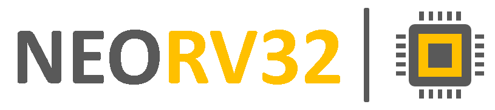

= The NEORV32 RISC-V Processor
:author: Dipl.-Ing. Stephan Nolting
:email: stnolting@gmail.com
:description: A size-optimized, customizable and open-source full-scale 32-bit RISC-V soft-core CPU and SoC written in platform-independent VHDL.
:revnumber: v1.5.4.6
:doctype: book
:sectnums:
:icons: image
:iconsdir: icons
:stem:
:reproducible:
:listing-caption: Listing
:toc:
:toclevels: 4
:title-logo-image: 
// Uncomment next line to add a title page (or set doctype to book)
//:title-page:
// Uncomment next line to set page size (default is A4)
//:pdf-page-size: Letter

// ------------------------------------------------------------------------------------------------
// ------------------------------------------------------------------------------------------------
:sectnums!:
== Proprietary and Legal Notice

* "GitHub" is a Subsidiary of Microsoft Corporation.
* "Vivado" and "Artix" are trademarks of Xilinx Inc.
* "AXI" and "AXI4-Lite" are trademarks of Arm Holdings plc.
* "ModelSim" is a trademark of Mentor Graphics – A Siemens Business.
* "Quartus Prime" and "Cyclone" are trademarks of Intel Corporation.
* "iCE40", "UltraPlus" and "Radiant" are trademarks of Lattice Semiconductor Corporation.
* "Windows" is a trademark of Microsoft Corporation.
* "Tera Term" copyright by T. Teranishi.
* Timing diagrams made with WaveDrom Editor.
* "NeoPixel" is a trademark of Adafruit Industries.

Icons from https://www.flaticon.com and made by
link:https://www.freepik.com[Freepik], link:https://www.flaticon.com/authors/good-ware[Good Ware],
link:https://www.flaticon.com/authors/pixel-perfect[Pixel perfect], link:https://www.flaticon.com/authors/vectors-market[Vectors Market]

**Limitation of Liability for External Links**

This document contains links to the websites of third parties ("external links"). As the content of these websites
is not under our control, we cannot assume any liability for such external content. In all cases, the provider of
information of the linked websites is liable for the content and accuracy of the information provided. At the
point in time when the links were placed, no infringements of the law were recognizable to us. As soon as an
infringement of the law becomes known to us, we will immediately remove the link in question.

**Disclaimer**

This project is released under the BSD 3-Clause license. No copyright infringement
intended. Other implied or used projects might have different licensing – see their documentation to get more information.

<<<
:sectnums!:
== BSD 3-Clause License
Copyright (c) 2021, Stephan Nolting. All rights reserved.

Redistribution and use in source and binary forms, with or without modification, are permitted provided that
the following conditions are met:

. Redistributions of source code must retain the above copyright notice, this list of conditions and the
following disclaimer.
. Redistributions in binary form must reproduce the above copyright notice, this list of conditions and
the following disclaimer in the documentation and/or other materials provided with the distribution.
. Neither the name of the copyright holder nor the names of its contributors may be used to endorse or
promote products derived from this software without specific prior written permission.

THIS SOFTWARE IS PROVIDED BY THE COPYRIGHT HOLDERS AND CONTRIBUTORS "AS IS"
AND ANY EXPRESS OR IMPLIED WARRANTIES, INCLUDING, BUT NOT LIMITED TO, THE
IMPLIED WARRANTIES OF MERCHANTABILITY AND FITNESS FOR A PARTICULAR PURPOSE
ARE DISCLAIMED. IN NO EVENT SHALL THE COPYRIGHT HOLDER OR CONTRIBUTORS BE
LIABLE FOR ANY DIRECT, INDIRECT, INCIDENTAL, SPECIAL, EXEMPLARY, OR
CONSEQUENTIAL DAMAGES (INCLUDING, BUT NOT LIMITED TO, PROCUREMENT OF
SUBSTITUTE GOODS OR SERVICES; LOSS OF USE, DATA, OR PROFITS; OR BUSINESS
INTERRUPTION) HOWEVER CAUSED AND ON ANY THEORY OF LIABILITY, WHETHER IN
CONTRACT, STRICT LIABILITY, OR TORT (INCLUDING NEGLIGENCE OR OTHERWISE)
ARISING IN ANY WAY OUT OF

==========================
The *NEORV32 Processor* Project

(c) 2021, by Dipl.-Ing. Stephan Nolting, Hannover, Germany

https://github.com/stnolting/neorv32

*contact:* stnolting@gmail.com
==========================

// ------------------------------------------------------------------------------------------------
// ------------------------------------------------------------------------------------------------

include::overview.adoc[]

include::cpu.adoc[]

include::soc.adoc[]

include::software.adoc[]

include::getting_started.adoc[]
