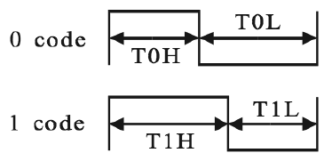

<<<
:sectnums:
==== Smart LED Interface (NEOLED)

[cols="<3,<3,<4"]
[frame="topbot",grid="none"]
|=======================
| Hardware source file(s): | neorv32_neoled.vhd | 
| Software driver file(s): | neorv32_neoled.c |
|                          | neorv32_neoled.h |
| Top entity port:         | `neoled_o` | 1-bit serial data
| Configuration generics:  | _IO_NEOLED_EN_ | implement NEOLED when _true_
| CPU interrupts:          | fast IRQ channel 9 | NEOLED interrupt (see <<_processor_interrupts>>)
|=======================

**Theory of Operation**

The NEOLED module provides a dedicated interface for "smart RGB LEDs" like the WS2812 or WS2811.
These LEDs provide a single interface wire that uses an asynchronous serial protocol for transmitting color
data. Basically, data is transferred via LED-internal shift registers, which allows to cascade an unlimited
number of smart LEDs. The protocol provides a RESET command to strobe the transmitted data into the
LED PWM driver registers after data has shifted throughout all LEDs in a chain.

[NOTE]
The NEOLED interface is compatible to the "Adafruit Industries NeoPixel" products, which feature
WS2812 (or older WS2811) smart LEDs (see link:https://learn.adafruit.com/adafruit-neopixel-uberguide).

The interface provides a single 1-bit output `neoled_o` to drive an arbitrary number of LEDs. Since the
NEOLED module provides 24-bit and 32-bit operating modes, a mixed setup with RGB LEDs (24-bit color)
and RGBW LEDs (32-bit color including a dedicated white LED chip) is also possible.

**Theory of Operation – Protocol**

The interface of the WS2812 LEDs uses an 800kHz carrier signal. Data is transmitted in a serial manner
starting with LSB-first. The intensity for each R, G & B LED chip (= color code) is defined via an 8-bit
value. The actual data bits are transferred by modifying the duty cycle of the signal (the timings for the
WS2812 are shown below). A RESET command is "send" by pulling the data line LOW for at least 50μs.

.WS2812 bit-level protocol - taken from the "Adafruit NeoPixel Überguide"

.WS2812 interface timing
[cols="<2,<2,<6"]
[grid="all"]
|=======================
| T~total~ (T~carrier~) | 1.25μs +/- 300ns  | period for a single bit
| T~0H~                 | 0.4μs +/- 150ns   | high-time for sending a `1`
| T~0L~                 | 0.8μs +/- 150ns   | low-time for sending a `1`
| T~1H~                 | 0.85μs +/- 150ns  | high-time for sending a `0`
| T~1L~                 | 0.45μs +/- 150 ns | low-time for sending a `0`
| RESET                 | Above 50μs        | low-time for sending a RESET command
|=======================

**Theory of Operation – NEOLED Module**

The NEOLED modules provides two accessible interface register: the control register _NEOLED_CT_ and the
TX data register _NEOLED_DATA_. The NEOLED module is globally enabled via the control register's
_NEOLED_CT_EN_ bit. Clearing this bit will terminate any current operation, reset the module and
set the `neoled_o` output to zero. The precise timing (implementing the **WS2812** protocol) and transmission
mode are fully programmable via the _NEOLED_CT_ register to provide maximum flexibility.

**Timing Configuration**

The basic carrier frequency (800kHz for the WS2812 LEDs) is configured via a 3-bit main clock prescaler (_NEOLED_CT_PRSCx_, see table below)
that scales the main processor clock f~main~ and a 5-bit cycle multiplier _NEOLED_CT_T_TOT_x_.

.NEOLED prescaler configuration
[cols="<4,^1,^1,^1,^1,^1,^1,^1,^1"]
[options="header",grid="rows"]
|=======================
| **`NEOLED_CT_PRSCx`**       | `0b000` | `0b001` | `0b010` | `0b011` | `0b100` | `0b101` | `0b110` | `0b111`
| Resulting `clock_prescaler` |       2 |       4 |       8 |      64 |     128 |    1024 |    2048 |    4096
|=======================

The duty-cycles (or more precisely: the high- and low-times for sending either a '1' bit or a '0' bit) are
defined via the 5-bit _NEOLED_CT_T_ONE_H_x_ and _NEOLED_CT_T_ZERO_H_x_ values, respecively. These programmable
timing constants allow to adapt the interface for a wide variety of smart LED protocol (for example WS2812 vs.
WS2811).

**Timing Configuration – Example (WS2812)**

Generate the base clock f~TX~ for the NEOLED TX engine:

* processor clock f~main~ = 100 MHz
* _NEOLED_CT_PRSCx_ = `0b001` = f~main~ / 4

_**f~TX~**_ = _f~main~[Hz]_ / `clock_prescaler` = 100MHz / 4 = 25MHz

_**T~TX~**_ = 1 / _**f~TX~**_ = 40ns

Generate carrier period (T~carrier~) and *high-times* (duty cycle) for sending `0` (T~0H~) and `1` (T~1H~) bits:

* _NEOLED_CT_T_TOT_ = `0b11110` (= decimal 30)
* _NEOLED_CT_T_ZERO_H_ = `0b01010` (= decimal 10)
* _NEOLED_CT_T_ONE_H_ = `0b10100` (= decimal 20)

_**T~carrier~**_ = _**T~TX~**_ * _NEOLED_CT_T_TOT_ = 40ns * 30 = 1.4µs

_**T~0H~**_ = _**T~TX~**_ * _NEOLED_CT_T_ZERO_H_ = 40ns * 10 = 0.4µs

_**T~1H~**_ = _**T~TX~**_ * _NEOLED_CT_T_ONE_H_ = 40ns * 20 = 0.8µs

[TIP]
The NEOLED SW driver library (`neorv32_neoled.h`) provides a simplified configuration
function that configures all timing parameters for driving WS2812 LEDs based on the processor
clock configuration.

**RGB / RGBW Configuration**

NeoPixel are available in two "color" version: LEDs with three chips providing RGB color and LEDs with
four chips providing RGB color plus a dedicated white LED chip (= RGBW). Since the intensity of every
LED chip is defined via an 8-bit value the RGB LEDs require a frame of 24-bit per module and the RGBW
LEDs require a frame of 32-bit per module.

The data transfer quantity of the NEOLED module can be configured via the _NEOLED_MODE_EN_ control
register bit. If this bit is cleared, the NEOLED interface operates in 24-bit mode and will transmit bits `23:0` of
the data written to _NEOLED_DATA_. If _NEOLED_MODE_EN_ is set, the NEOLED interface operates in 32-bit
mode and will transmit bits `31:0` of the data written to _NEOLED_DATA_.

**TX Data FIFO**

The interface features a TX data buffer (a FIFO) to allow CPU-independent operation. The buffer depth
is configured via the `tx_buffer_entries_c` constant (default = 4 entries) in the module's VHDL source
file `rtl/core/neorv32_neoled.vhd`. The current configuration can be read via the _NEOLED_CT_BUFS_x_
control register bits, which result log2(`tx_buffer_entries_c`).

When writing data to the _NEOLED_DATA_ register the data is automatically written to the TX buffer. Whenever
data is available in the buffer the serial transmission engine will take it and transmit it to the LEDs.

The data transfer size (_NEOLED_MODE_EN_) can be modified at every time since this control register bit is also buffered
in the FIFO. This allows to arbitrarily mixing RGB and RGBW LEDs in the chain.

[WARNING]
Please note that the timing configurations (_NEOLED_CT_PRSCx_, _NEOLED_CT_T_TOT_x_,
_NEOLED_CT_T_ONE_H_x_ and _NEOLED_CT_T_ZERO_H_x_) are NOT stored to the buffer. Changing
these value while the buffer is not empty or the TX engine is still sending will cause data corruption.

**Status Configuration**

The NEOLED modules features two read-only status bits in the control register: _NEOLED_CT_BUSY_ and
_NEOLED_CT_TX_STATUS_.

If the _NEOLED_CT_TX_STATUS_ is set the serial TX engine is still busy sending serial data to the LED stripes.
If the flag is cleared, the TX engine is idle and the serial data output `neoled_o` is set LOW.

The _NEOLED_CT_BUSY_ flag provides a programmable option to check for the TX buffer state. The control
register's _NEOLED_CT_BSCON_ bit is used to configure the "meaning" of the _NEOLED_CT_BUSY_ flag. The
condition for sending an interrupt request (IRQ) to the CPU is also configured via the _NEOLED_CT_BSCON_
bit.

[cols="^5,^8,^8"]
[options="header",grid="all"]
|=======================
| _NEOLED_CT_BSCON_ | _NEOLED_CT_BUSY_ | Sending an IRQ when ...
| 0 | the busy flag will clear if there **IS at least one free entry** in the TX buffer | the IRQ will fire if **at least one entry GETS free** in the TX buffer
| 1 | the busy flag will clear if the **whole TX buffer IS empty** | the IRQ will fire if the **whole TX buffer GETS empty**
|=======================

When _NEOLED_CT_BSCON_ is set, the CPU can write up to `tx_buffer_entries_c` of new data words to
_NEOLED_DATA_ without checking the busy flag _NEOLED_CT_BUSY_. This highly relaxes time constraints for
sending a continuous data stream to the LEDs (as an idle time beyond 50μs will trigger the LED's a RESET
command).

<<<
.NEOLED register map
[cols="<4,<5,<9,^2,<9"]
[options="header",grid="all"]
|=======================
| Address | Name [C] | Bit(s), Name [C] | R/W | Function
.22+<| `0xffffffd8` .22+<| _NEOLED_CT_ <|`0` _NEOLED_CT_EN_         ^| r/w <| NCO enable
                                       <|`1` _NEOLED_CT_MODE_       ^| r/w <| data transfer size; `0`=24-bit; `1`=32-bit
                                       <|`2` _NEOLED_CT_BSCON_      ^| r/w <| busy flag / IRQ trigger configuration (see table above)
                                       <|`3` _NEOLED_CT_PRSC0_      ^| r/w <| 3-bit clock prescaler, bit 0
                                       <|`4` _NEOLED_CT_PRSC1_      ^| r/w <| 3-bit clock prescaler, bit 1
                                       <|`5` _NEOLED_CT_PRSC2_      ^| r/w <| 3-bit clock prescaler, bit 2
                                       <|`6` _NEOLED_CT_BUFS0_      ^| r/- .4+<| 4-bit log2(`tx_buffer_entries_c`)
                                       <|`7` _NEOLED_CT_BUFS1_      ^| r/- 
                                       <|`8` _NEOLED_CT_BUFS2_      ^| r/- 
                                       <|`9` _NEOLED_CT_BUFS3_      ^| r/- 
                                       <|`10` _NEOLED_CT_T_TOT_0_   ^| r/w .5+| 5-bit pulse clock ticks per total single-bit period (T~total~)
                                       <|`11` _NEOLED_CT_T_TOT_1_   ^| r/w 
                                       <|`12` _NEOLED_CT_T_TOT_2_   ^| r/w 
                                       <|`13` _NEOLED_CT_T_TOT_3_   ^| r/w 
                                       <|`14` _NEOLED_CT_T_TOT_4_   ^| r/w 
                                       <|`20` _NEOLED_CT_ONE_H_0_   ^| r/w .5+<| 5-bit pulse clock ticks per high-time for sending a one-bit (T~H1~)
                                       <|`21` _NEOLED_CT_ONE_H_1_   ^| r/w 
                                       <|`22` _NEOLED_CT_ONE_H_2_   ^| r/w 
                                       <|`23` _NEOLED_CT_ONE_H_3_   ^| r/w 
                                       <|`24` _NEOLED_CT_ONE_H_4_   ^| r/w 
                                       <|`30` _NEOLED_CT_TX_STATUS_ ^| r/- <| transmit engine busy when `1`
                                       <|`31` _NEOLED_CT_BUSY_      ^| r/- <| busy / buffer status flag; configured via _NEOLED_CT_BSCON_ (see table above)
| `0xffffffdc` | _NEOLED_DATA_         <|`31:0` / `23:0`            ^| -/w <| TX data (32-/24-bit)
|=======================
