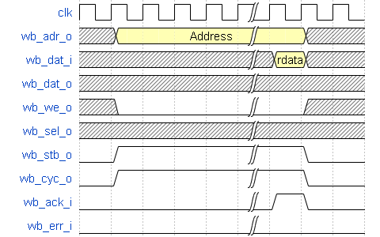
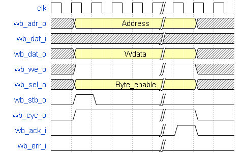

<<<
:sectnums:
==== Processor-External Memory Interface (WISHBONE) (AXI4-Lite)

[cols="<3,<3,<4"]
[grid="topbot"]
|=======================
| Hardware source file(s): | neorv32_wishbone.vhd | 
| Software driver file(s): | none             | _implicitly used_
| Top entity port:         | `wb_tag_o`  | request tag output (3-bit)
|                          | `wb_adr_o`  | address output (32-bit)
|                          | `wb_dat_i`  | data input (32-bit)
|                          | `wb_dat_o`  | data output (32-bit)
|                          | `wb_we_o`   | write enable (1-bit)
|                          | `wb_sel_o`  | byte enable (4-bit)
|                          | `wb_stb_o`  | strobe (1-bit)
|                          | `wb_cyc_o`  | valid cycle (1-bit)
|                          | `wb_lock_o` | exclusive access request (1-bit)
|                          | `wb_ack_i`  | acknowledge (1-bit)
|                          | `wb_err_i`  | bus error (1-bit)
|                          | `fence_o`   | indicates an executed fence instruction
|                          | `fencei_o`  | indicates an executed fence.i instruction
| Configuration generics:  | _MEM_EXT_EN_ | enable external memory interface when _true_
| Configuration constants in VHDL package file `neorv32_package.vhd`: | `wb_pipe_mode_c` | when _false_ (default): classic/standard Wishbone protocol; when _true_: pipelined Wishbone protocol
|                                                                     | `bus_timeout_c` | cycles after which an unacknowledged bus access will time out, get canceled and triggers a bus exception interrupt, default = 127
|                                                                     | `xbus_big_endian_c` | byte-order (Endianness) of external memory interface (true=BIG (default), false=little)
| CPU interrupts:          | none             | 
|=======================

The external memory interface uses the Wishbone interface protocol. The external interface port is available
when the _MEM_EXT_EN_ generic is _true_. This interface can be used to attach external memories, custom
hardware accelerators additional IO devices or all other kinds of IP blocks. All memory accesses from the
CPU, that do not target the internal bootloader ROM, the internal IO region or the internal data/instruction
memories (if implemented at all) are forwarded to the Wishbone gateway and thus to the external memory
interface.

[TIP]
When using the default processor setup, all access addresses between 0x00000000 and
0xffff0000 (= beginning of processor-internal BOOT ROM) are delegated to the external memory
/ bus interface if they are not targeting the (actually enabled/implemented) processor-internal
instruction memory (IMEM) or the (actually enabled/implemented) processor-internal data memory
(DMEM). See section <<_address_space>> for more information.

**Wishbone Bus Protocol**

The external memory interface either uses **standard** ("classic") Wishbone transactions (default) or
**pipelined** Wishbone transactions. The transaction protocol is configured via the wb_pipe_mode_c constant
in the in the main VHDL package file (`rtl/neorv32_package.vhd`):

[source,vhdl]
----
-- (external) bus interface --
constant wb_pipe_mode_c : boolean := false;
----

When `wb_pipe_mode_c` is disabled, all bus control signals including _STB_ are active (and stable) until the
transfer is acknowledged/terminated. If `wb_pipe_mode_c` is enabled, all bus control except _STB_ are active
(and stable) until the transfer is acknowledged/terminated. In this case, _STB_ is active only during the very
first bus clock cycle.

."Classic" Wishbone read access

."Pipelined" Wishbone write access

[TOP]
A detailed description of the implemented Wishbone bus protocol and the according interface signals
can be found in the data sheet "Wishbone B4 – WISHBONE System-on-Chip (SoC) Interconnection
Architecture for Portable IP Cores". A copy of this document can be found in the docs folder of this
project.

**Latency**

The Wishbone gateway introduces two additional latency cycles: Processor-outgoing and -incoming signals
are fully registered. Thus, any access from the CPU to a processor-external devices takes at least four cycles
if the accessed device can respond within the same cycle the external bus access is initiated.
If the CPU cancels an active Wishbone transaction, the bus interface goes into suspend mode, that still keeps
the transaction active for some time to allow the bus system to acknowledge the transfer. If the bus system
still does not terminate the transfer, the bus interface forces a termination.

**Bus Access Timeout**

Whenever the CPU starts a memory access, an internal timer is started. If the accessed address (the memory
or peripheral device) does not acknowledge the transfer within a certain time, the bus access is canceled and
a load/store/instruction fetch bus access fault exception is raised – depending on the bus access type.

The processor-internal memories and peripherals will always acknowledge the transfers within two cycles.
Of course, a bus timeout will occur if accessing unused address locations. For example, a bus timeout and
thus, a load/store bus access fault will occur when trying to access an IO device that has not been
implemented.

The maximum bus cycle time (default = 127 cycles), after which a **bus access exception will be triggered**,
is defined via the global bus_timeout_c constant in the project's main VHDL package file
(`rtl/neorv32_package.vhd`):

[source,vhdl]
----
-- (external) bus interface --
constant bus_timeout_c : natural := 127;
----

Bus accesses via the external memory interface are acknowledged via the Wishbone-compatible `wb_ack_i`
signal. The external bus accesses can be terminated/aborted at any time by an accessed device/memory via
the Wishbone-compatible `wb_err_i` signal.

**Wishbone Tag**

The 3-bit wishbone `wb_tag_o` signal provides additional information regarding the access type. This signal
is compatible to the AXI4 _AxPROT_ signal.

* `wb_tag_o(0)` 1: privileged access (CPU is in machine mode); 0: nnprivileged access
* `wb_tag_o(1)` always zero (indicating "secure access")
* `wb_tag_o(2)` 1: instruction fetch access, 0: data access

**Exclusive / Atomic Bus Access**

If the atomic memory access CPU extension (via _CPU_EXTENSION_RISCV_A_) is enabled, the CPU can
request an atomic/exclusive bus access via the external memory interface.

The load-reservate instruction (`lr.w`) will set the `wb_lock_o` signal telling the bus interconnect to establish a
reservation for the current accessed address (start of an exclusive access). This signal will stay asserted until
another memory access instruction is executed (for example a `sc.w`).

The memory system has to make sure that no other entity can access the reservated address until `wb_lock_o`
is released again. If this attempt fails, the memory system has to assert `wb_err_i` in order to indicate that the
reservation was broken.

[TIP]
See section <<_bus_interface>> for the CPU bus interface protocol.

**Endianness**

The NEORV32 CPU and the Processor setup are BIG-endian architectures. However, to allow a connection
to a little-endian memory system the external bus interface provides an Endianness configuration. The
Endianness can be configured via the global `xbus_big_endian_c` constant in the main VHDL package file
(rtl/neorv32_package.vhd). By default, the external memory interface uses BIG-endian byte-order.

[source,vhdl]
----
-- (external) bus interface --
constant xbus_big_endian_c : boolean := true;
----

Application software can check the Endianness configuration of the external bus interface via the
_SYSINFO_FEATURES_MEM_EXT_ENDIAN_ flag in the processor's SYSINFO module (see section
<<_system_configuration_information_memory_sysinfo>> for more information).

**AXI4-Lite Connectivity**

The AXI4-Lite wrapper (`rtl/top_templates/neorv32_top_axi4lite.vhd`) provides a Wishbone-to-
AXI4-Lite bridge, compatible with Xilinx Vivado (IP packager and block design editor). All entity signals of
this wrapper are of type _std_logic_ or _std_logic_vector_, respectively.

The AXI Interface has been verified using Xilinx Vivado IP Packager and Block Designer. The AXI
interface port signals are automatically detected when packaging the core.

.Example AXI SoC using Xilinx Vivado
image:../figures/neorv32_axi_soc.png[]
