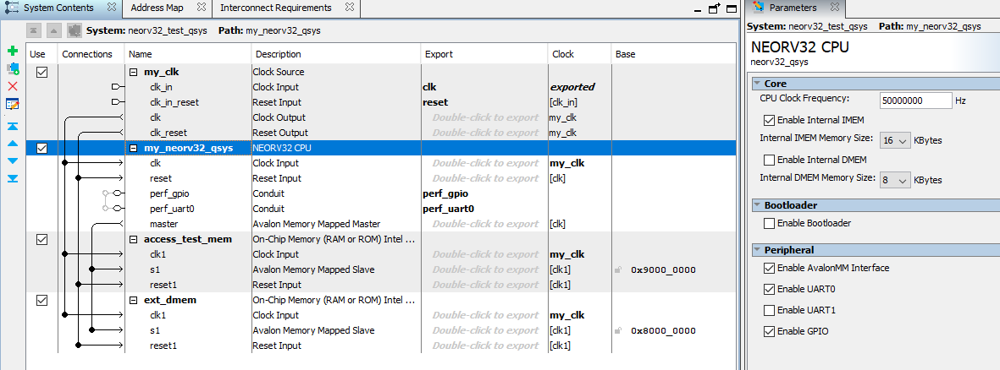

# NEORV32 Test Setup using the NEORV32 as a Nios II drop-in replacement

This setup provides a very simple "demo setup" that uses the NEORV32 Qsys/Platform Designer component
so that the NEORV32 can be used as a drop-in replacement of the Nios II soft CPU from Intel.
The demo is running on the Terasic DE0-Nano FPGA Board.

The design is based on the de0-nano-test-setup, but the NEORV32 cpu is added as a QSys/Platform Designer
component. As an example the DMEM is "external" and uses an Platform Designer SRAM block.



For details about the design and use of the NEORV32 as a Qsys/Platform Designer component please
look at the Qsys component files and documentation here [`NEORV32 Qsys Component`](../neorv32_qsys_component)

It uses the simplified simple example top entity that provides a minimalistic interface (clock, reset, UART and 8 LEDs).

* FPGA Board: :books: [Terasic DE0-Nano FPGA Board](https://www.terasic.com.tw/cgi-bin/page/archive.pl?Language=English&CategoryNo=139&No=593)
* FPGA: Intel Cyclone-IV `EP4CE22F17C6N`
* Toolchain: Intel Quartus Prime (tested with Quartus Prime 18.1.1 - Lite Edition)


### NEORV32 Configuration

For NEORV32 configuration the default values of the neorv32_top in version 1.6.0 are used
with a few exceptions:

* Memory: 16kB instruction memory (internal IMEM), 8kB data memory (external DMEM), No bootloader
* Tested with version [`1.6.0`](https://github.com/stnolting/neorv32/blob/master/CHANGELOG.md)
* Clock: 50MHz from on-board oscillator
* Reset: via on-board button "KEY0"
* GPIO output port `gpio_o` (8-bit) connected to the 8 green user LEDs ("LED7" - "LED0")
* UART0 signals `uart0_txd_o` and `uart0_rxd_i` are connected to the 40-pin **GPIO_0** header
  * `uart0_txd_o:` output, connected to FPGA pin `C3` - header pin `GPIO_01` (pin number "4")
  * `uart0_rxd_i:` input, connected to FPGA pin `A3` - header pin `GPIO_03` (pin number "6")

### FPGA Utilization

```
Total logic elements 4,064 / 22,320 ( 18 % )
Total registers      1932
Total pins           12 / 154 ( 8 % )
Total virtual pins   0
Total memory bits    230,400 / 608,256 ( 38 % )
Embedded Multiplier  9-bit elements	0 / 132 ( 0 % )
Total PLLs           0 / 4 ( 0 % )
```


## How To Run

Open the Quartus project file, compile and upload to FPGA.