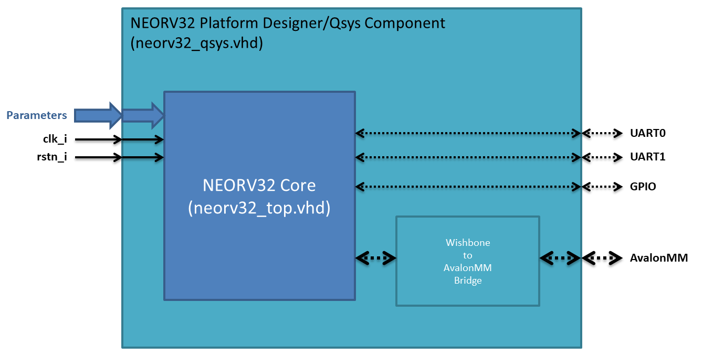
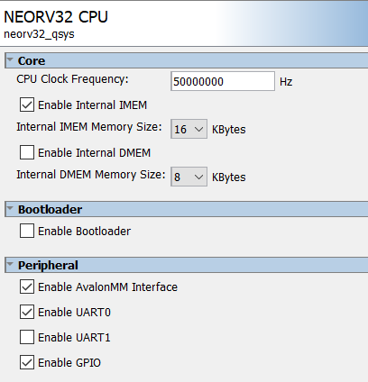

# NEORV32 Platform Designer Component

This folder contains a Qsys/Platform Designer wrapper for the NEORV32 together with
an Wishbone to AvalonMM bridge. This makes the NEORV32 a drop-in replacement for the
Altera/Intel Nios II soft CPU.

This is just a quick template showing a possible solution, and not a feature complete
solution. All parameters in the Generic section could be added to the GUI.

Only some peripherals (UART0, UART1 and GPIO) are connected, but other peripheral
could easily be connected.

## Solution overview

The solution is made up of 3 files. One VHDL file for the component implementation
(neorv32_qsys.vhd), one file for the Qsys component (neorv32_qsys_hw.tcl) and one file 
listing files to include (neorv32_qsys.qip) to simplify the Quartus setup (.qsf) file.
The figure below shows how the component is implemented.



## GUI Settings

The Qsys component is created so that some parameters can be set in the Platform Design
GUI. More settings could be added as needed.



## Implementation notes

The Platform Designer has a bug (feature?) that makes boolean parameters from the Platform
Designer GUI being port mapped to the VHDL component generic as 0/1 instead of true/false. 
This is a known bug/feature.

A workaround for this is made by making the generic (boolean) parameters in the VHDL
as "integer", and then use a "integer2bool" function to make the parameter boolean
again to fit the NEORV32 top.

## How to use

To use the Qsys component in your Platform Designer design, you will just need to
make a "User_Components.ipx" file in your Qsys folder, and reference this (rtl/system_integration/neorv32_qsys_component) folder.

Example "User_Components.ipx" content:
```
<library>
	<path path="../neorv32_qsys_component/**/*" />
</library>
```

You will also need to add 3 lines in your Quartus project file (QSF-file) in order to
get the correct source files.

Example QSF-file info:
```
......
set_global_assignment -name QIP_FILE ../neorv32_qsys_component/neorv32_qsys.qip
set_global_assignment -name VHDL_FILE ../../../rtl/core/neorv32_application_image.vhd
set_global_assignment -name VHDL_FILE ../../../rtl/core/neorv32_bootloader_image.vhd
......
```

Having seperate links for the bootloader and application images makes it easy to include images
from your own project folders.

# NEORV32 Platform Designer Component - Example Design

The branch contains an example design using the Qsys/Platform designer component
and running on the DE0 Nano board.

The example design can be found here [setups/quartus/de0-nano-test-setup-qsys`](../de0-nano-test-setup-qsys)

The example design will run the software examples.
